# Atlas PPM — Functional Flows

Flow diagrams in three views: **system & data flows**, **user journeys** (persona → goal), and **software-development interaction**. Each entry shows live Mermaid + a static PNG in `images/`.

## System & data flows

- [Application map & navigation](#00-app-sitemap)
- [Authentication & RBAC gate](#01-auth-rbac)
- [Dashboard — layout switching & data](#02-dashboard)
- [Demand intake → scoring → approval funnel](#03-demands)
- [Portfolio → Project drill-in](#04-portfolio-project)
- [Project stage gates (G0–G5) & reviews](#05-project-gates)
- [Task board move — realtime, cap-schedule](#06-tasks-board)
- [Timeline / Gantt & cross-entity dependencies](#07-gantt)
- [Resource utilisation & capacity](#08-resources)
- [Financials roll-up → portfolio ROI](#09-financials)
- [Program detail — stakeholder matrix](#10-programs)
- [Products → Releases → deployment](#11-products-releases)
- [OKRs — objectives, key results, linkage](#12-okrs)
- [Delivery status reporting by period](#13-delivery)
- [Weekly news wall (edit / view)](#14-news)
- [Connector sync (Jira / Azure DevOps)](#15-integrations-sync)
- [Whiteboard live co-editing](#16-whiteboard)
- [Reports & export](#17-reports)
- [Administration](#18-admin)
- [Governance & compliance](#19-governance-compliance)

## User journeys

- [Executive — portfolio review](#user-01-executive-review)
- [PMO — triage & approve a demand](#user-02-pmo-demand-approval)
- [PM — create a project (wizard)](#user-03-pm-create-project)
- [PM — manage tasks & Jira sync](#user-04-pm-manage-tasks)
- [PM — request a stage-gate review](#user-05-pm-stage-gate)
- [Team member — update my work](#user-06-team-member-update)
- [Stakeholder — check my status](#user-07-stakeholder-status)
- [Manager — My Team (skills · SWOT · dev plan)](#user-08-manager-team)
- [Platform Admin — administration](#user-09-platform-admin)
- [Chief Architect — governance](#user-10-architect-governance)

## Software-development interaction

- [Change lifecycle — issue → PR → merge](#dev-01-change-lifecycle)
- [CI pipeline — the gating jobs](#dev-02-ci-pipeline)
- [API type contract (OpenAPI → TS) + drift guard](#dev-03-api-type-contract)
- [Module-boundary ratchet (ADR-0072)](#dev-04-module-boundary)
- [Test strategy — unit → integration → e2e → perf](#dev-05-test-strategy)
- [Local dev loop (auth on/off)](#dev-06-local-dev)
- [Build & air-gapped deploy](#dev-07-build-deploy)
- [Runtime topology (component interaction)](#dev-08-runtime-topology)
- [Extending a connector (IWorkItemConnector)](#dev-09-connector-extension)

---

# System & data flows

## Application map & navigation

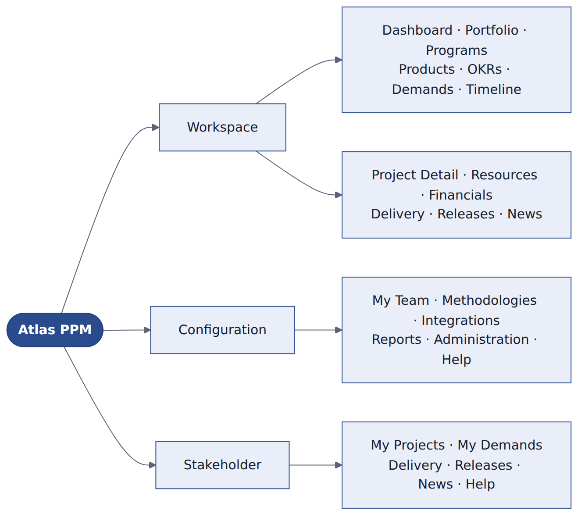

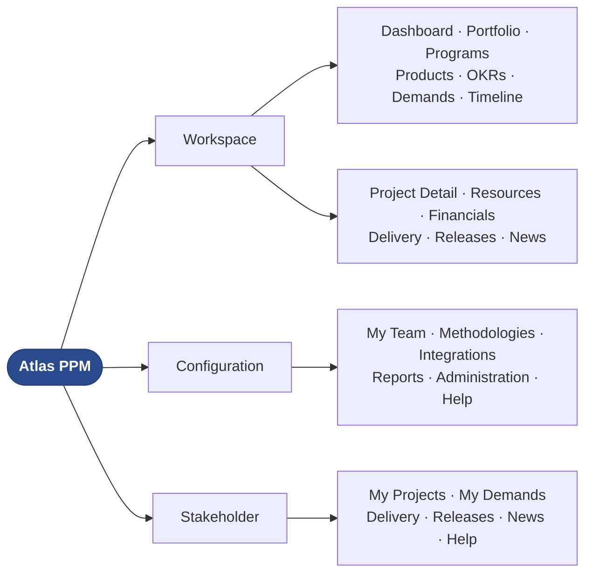
```mermaid
graph LR
  ATLAS(["Atlas PPM"]):::start
  ATLAS --> WS["Workspace"]
  ATLAS --> CFG["Configuration"]
  ATLAS --> STK["Stakeholder"]
  WS --> W1["Dashboard · Portfolio · Programs<br/>Products · OKRs · Demands · Timeline"]
  WS --> W2["Project Detail · Resources · Financials<br/>Delivery · Releases · News"]
  CFG --> C1["My Team · Methodologies · Integrations<br/>Reports · Administration · Help"]
  STK --> S1["My Projects · My Demands<br/>Delivery · Releases · News · Help"]
  classDef start fill:#2a4c8f,stroke:#22407a,color:#ffffff,font-weight:600;
```

## Authentication & RBAC gate

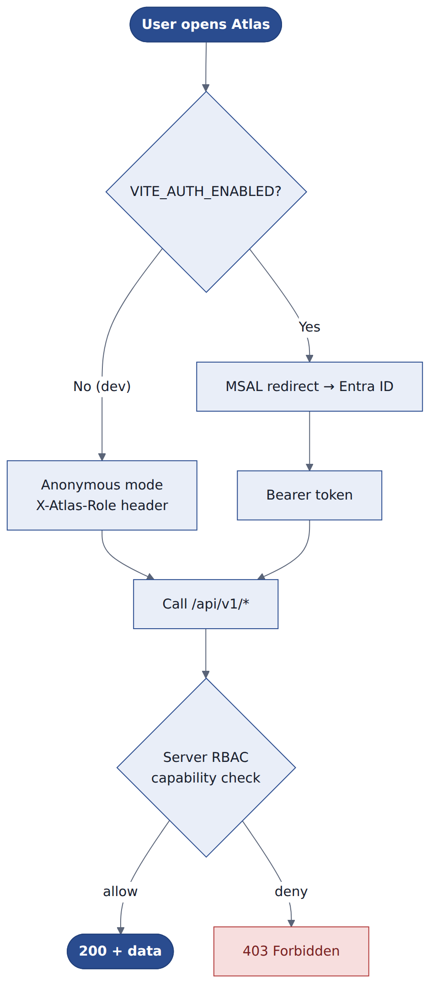

```mermaid
graph TD
  U(["User opens Atlas"]):::start --> A{"VITE_AUTH_ENABLED?"}
  A -- "No (dev)" --> DEV["Anonymous mode<br/>X-Atlas-Role header"]
  A -- "Yes" --> MSAL["MSAL redirect → Entra ID"]
  MSAL --> TOK["Bearer token"]
  DEV --> API["Call /api/v1/* "]
  TOK --> API
  API --> RBAC{"Server RBAC<br/>capability check"}
  RBAC -- allow --> OK(["200 + data"]):::start
  RBAC -- deny --> F["403 Forbidden"]:::deny
  classDef start fill:#2a4c8f,stroke:#22407a,color:#ffffff,font-weight:600;
  classDef deny fill:#f7dede,stroke:#b23a3a,color:#7a1f1f;
```

## Dashboard — layout switching & data

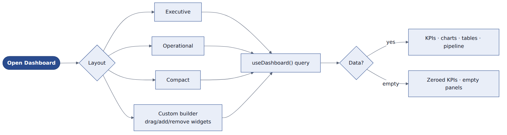

```mermaid
graph LR
  N(["Open Dashboard"]):::start --> L{"Layout"}
  L --> E["Executive"]
  L --> O["Operational"]
  L --> C["Compact"]
  L --> CU["Custom builder<br/>drag/add/remove widgets"]
  E --> Q["useDashboard() query"]
  O --> Q
  C --> Q
  CU --> Q
  Q --> D{"Data?"}
  D -- yes --> R["KPIs · charts · tables · pipeline"]
  D -- empty --> Z["Zeroed KPIs · empty panels"]
  classDef start fill:#2a4c8f,stroke:#22407a,color:#ffffff,font-weight:600;
```

## Demand intake → scoring → approval funnel

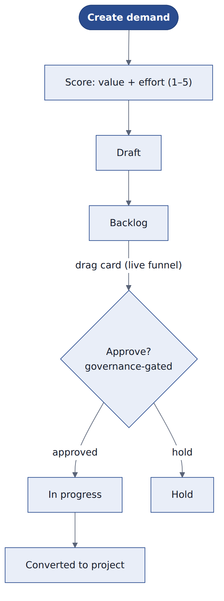

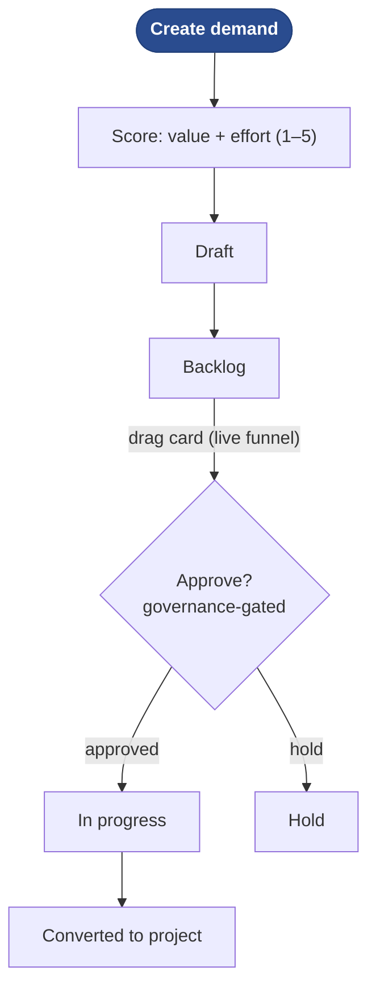
```mermaid
graph TD
  C(["Create demand"]):::start --> SC["Score: value + effort (1–5)"]
  SC --> DR["Draft"]
  DR --> BK["Backlog"]
  BK -->|"drag card (live funnel)"| AP{"Approve?<br/>governance-gated"}
  AP -- approved --> PG["In progress"]
  AP -- hold --> HD["Hold"]
  PG --> CV["Converted to project"]
  classDef start fill:#2a4c8f,stroke:#22407a,color:#ffffff,font-weight:600;
```

## Portfolio → Project drill-in

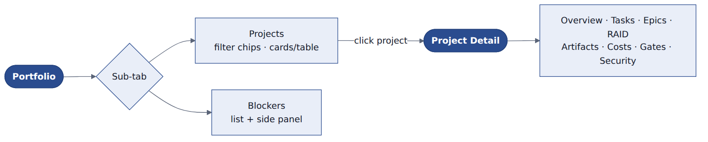

```mermaid
graph LR
  P(["Portfolio"]):::start --> T{"Sub-tab"}
  T --> PJ["Projects<br/>filter chips · cards/table"]
  T --> BK["Blockers<br/>list + side panel"]
  PJ -->|"click project"| PD(["Project Detail"]):::start
  PD --> TABS["Overview · Tasks · Epics · RAID<br/>Artifacts · Costs · Gates · Security"]
  classDef start fill:#2a4c8f,stroke:#22407a,color:#ffffff,font-weight:600;
```

## Project stage gates (G0–G5) & reviews

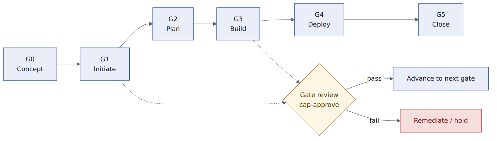

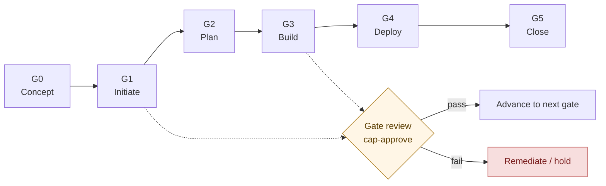
```mermaid
graph LR
  G0["G0<br/>Concept"] --> G1["G1<br/>Initiate"] --> G2["G2<br/>Plan"] --> G3["G3<br/>Build"] --> G4["G4<br/>Deploy"] --> G5["G5<br/>Close"]
  R{"Gate review<br/>cap-approve"}:::gate
  G1 -.-> R
  G3 -.-> R
  R -- pass --> ADV["Advance to next gate"]
  R -- fail --> REM["Remediate / hold"]:::deny
  classDef gate fill:#fff6e6,stroke:#a9791a,color:#5a3d00;
  classDef deny fill:#f7dede,stroke:#b23a3a,color:#7a1f1f;
```

## Task board move — realtime, cap-schedule

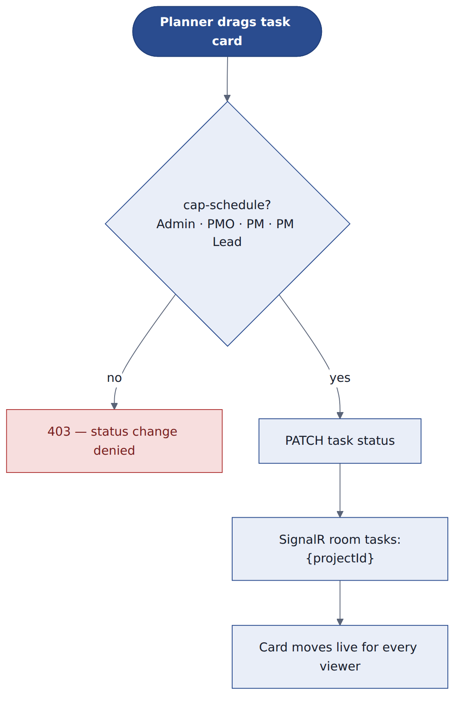

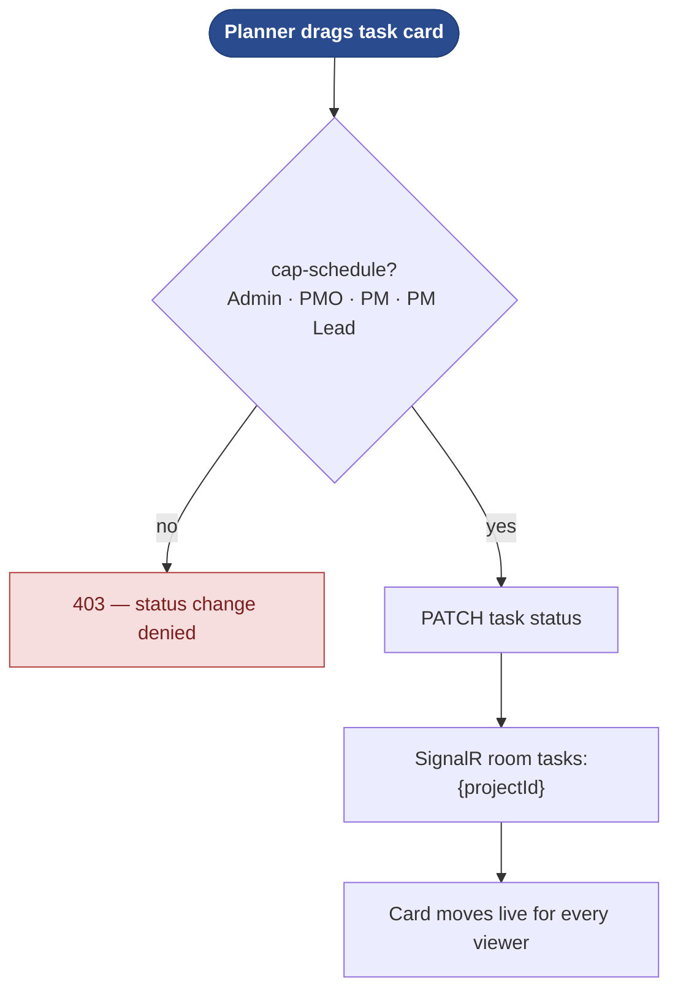
```mermaid
graph TD
  U(["Planner drags task card"]):::start --> CAP{"cap-schedule?<br/>Admin · PMO · PM · PM Lead"}
  CAP -- no --> DENY["403 — status change denied"]:::deny
  CAP -- yes --> MV["PATCH task status"]
  MV --> HUB["SignalR room tasks:{projectId}"]
  HUB --> PEERS["Card moves live for every viewer"]
  classDef start fill:#2a4c8f,stroke:#22407a,color:#ffffff,font-weight:600;
  classDef deny fill:#f7dede,stroke:#b23a3a,color:#7a1f1f;
```

## Timeline / Gantt & cross-entity dependencies

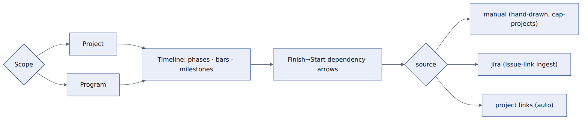

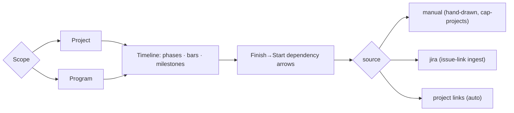
```mermaid
graph LR
  SC{"Scope"} --> PJ["Project"]
  SC --> PG["Program"]
  PJ --> T["Timeline: phases · bars · milestones"]
  PG --> T
  T --> DEP["Finish→Start dependency arrows"]
  DEP --> S{"source"}
  S --> M["manual (hand-drawn, cap-projects)"]
  S --> J["jira (issue-link ingest)"]
  S --> PL["project links (auto)"]
```

## Resource utilisation & capacity

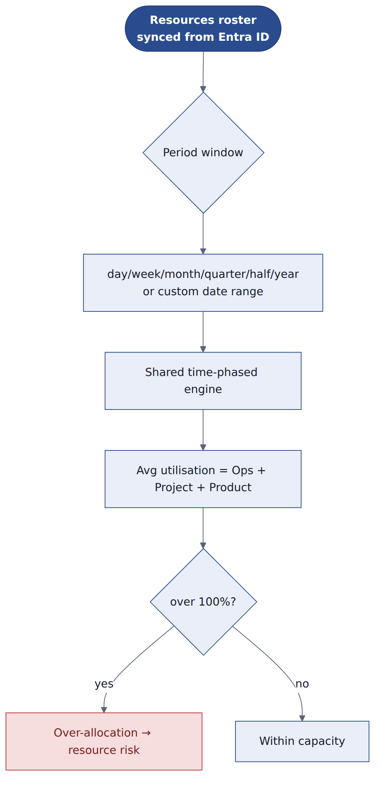

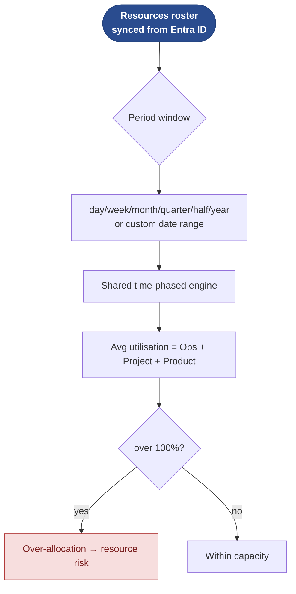
```mermaid
graph TD
  R(["Resources roster<br/>synced from Entra ID"]):::start --> W{"Period window"}
  W --> WIN["day/week/month/quarter/half/year<br/>or custom date range"]
  WIN --> ENG["Shared time-phased engine"]
  ENG --> UT["Avg utilisation = Ops + Project + Product"]
  UT --> OV{"over 100%?"}
  OV -- yes --> FLAG["Over-allocation → resource risk"]:::deny
  OV -- no --> OK["Within capacity"]
  classDef start fill:#2a4c8f,stroke:#22407a,color:#ffffff,font-weight:600;
  classDef deny fill:#f7dede,stroke:#b23a3a,color:#7a1f1f;
```

## Financials roll-up → portfolio ROI

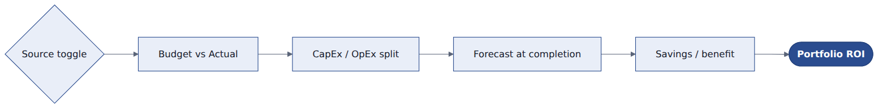

```mermaid
graph LR
  SRC{"Source toggle"} --> BUD["Budget vs Actual"]
  BUD --> SP["CapEx / OpEx split"]
  SP --> FAC["Forecast at completion"]
  FAC --> BEN["Savings / benefit"]
  BEN --> ROI(["Portfolio ROI"]):::start
  classDef start fill:#2a4c8f,stroke:#22407a,color:#ffffff,font-weight:600;
```

## Program detail — stakeholder matrix

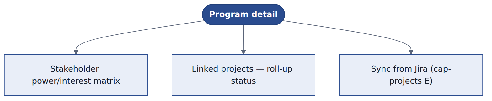

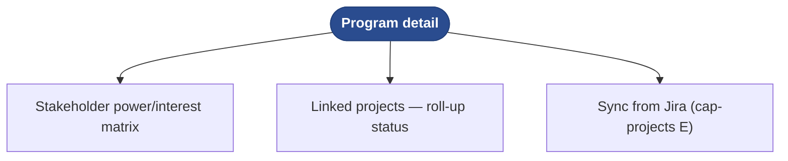
```mermaid
graph TD
  PG(["Program detail"]):::start --> MTX["Stakeholder power/interest matrix"]
  PG --> LP["Linked projects — roll-up status"]
  PG --> SY["Sync from Jira (cap-projects E)"]
  classDef start fill:#2a4c8f,stroke:#22407a,color:#ffffff,font-weight:600;
```

## Products → Releases → deployment

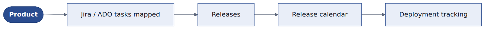

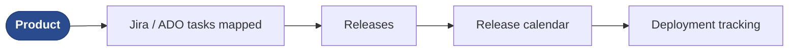
```mermaid
graph LR
  PRD(["Product"]):::start --> MAP["Jira / ADO tasks mapped"]
  MAP --> REL["Releases"]
  REL --> CAL["Release calendar"]
  CAL --> DEP["Deployment tracking"]
  classDef start fill:#2a4c8f,stroke:#22407a,color:#ffffff,font-weight:600;
```

## OKRs — objectives, key results, linkage

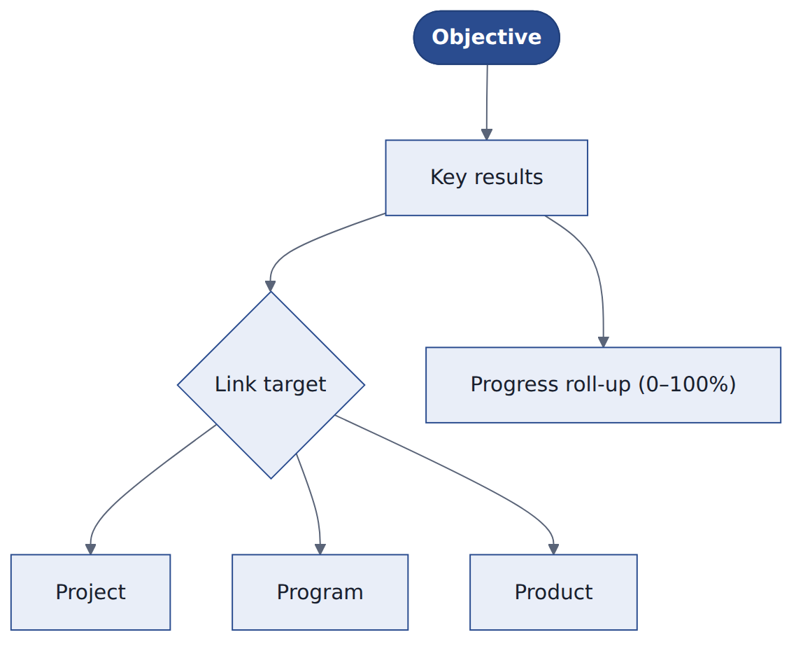

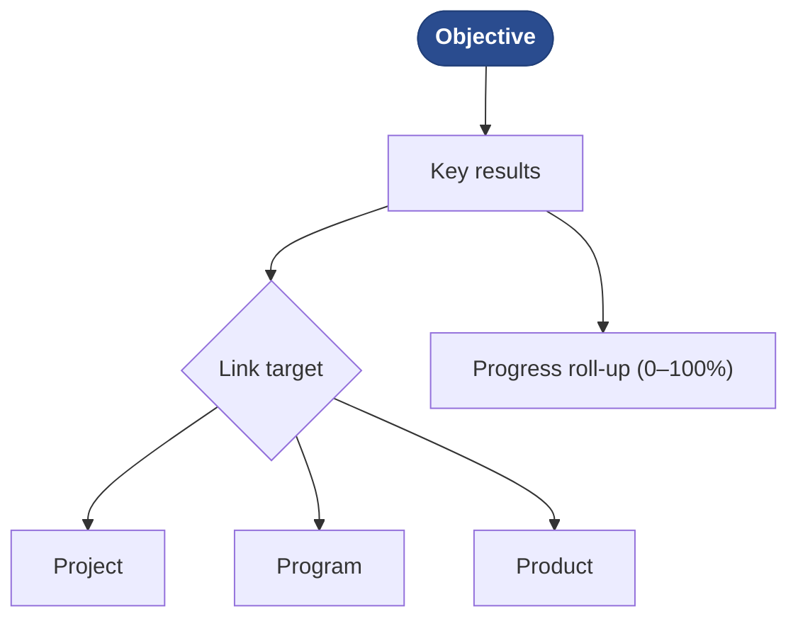
```mermaid
graph TD
  O(["Objective"]):::start --> KR["Key results"]
  KR --> L{"Link target"}
  L --> P["Project"]
  L --> PG["Program"]
  L --> PR["Product"]
  KR --> PROG["Progress roll-up (0–100%)"]
  classDef start fill:#2a4c8f,stroke:#22407a,color:#ffffff,font-weight:600;
```

## Delivery status reporting by period

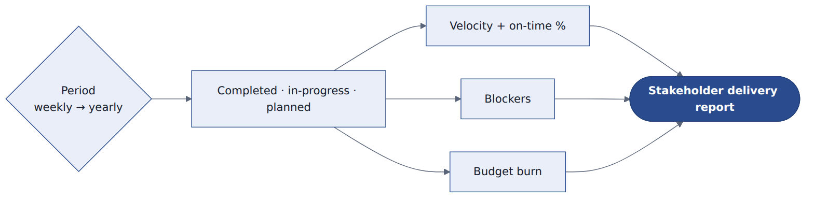

```mermaid
graph LR
  PER{"Period<br/>weekly → yearly"} --> AGG["Completed · in-progress · planned"]
  AGG --> VEL["Velocity + on-time %"]
  AGG --> BLK["Blockers"]
  AGG --> BURN["Budget burn"]
  VEL --> RPT(["Stakeholder delivery report"]):::start
  BLK --> RPT
  BURN --> RPT
  classDef start fill:#2a4c8f,stroke:#22407a,color:#ffffff,font-weight:600;
```

## Weekly news wall (edit / view)

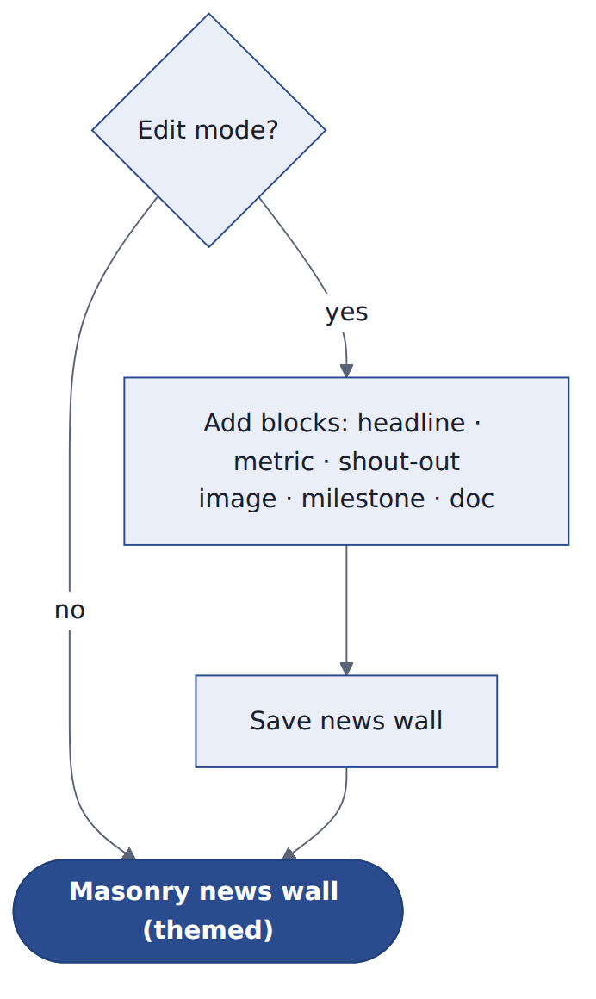

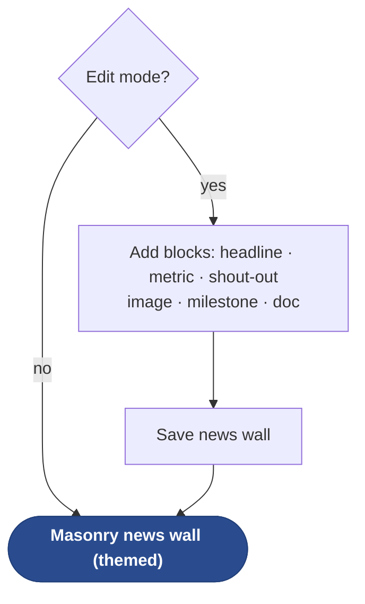
```mermaid
graph TD
  ED{"Edit mode?"} -- yes --> BLK["Add blocks: headline · metric · shout-out<br/>image · milestone · doc"]
  BLK --> SAVE["Save news wall"]
  ED -- no --> VIEW(["Masonry news wall (themed)"]):::start
  SAVE --> VIEW
  classDef start fill:#2a4c8f,stroke:#22407a,color:#ffffff,font-weight:600;
```

## Connector sync (Jira / Azure DevOps)

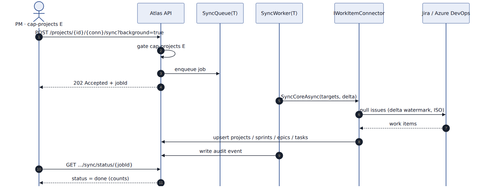

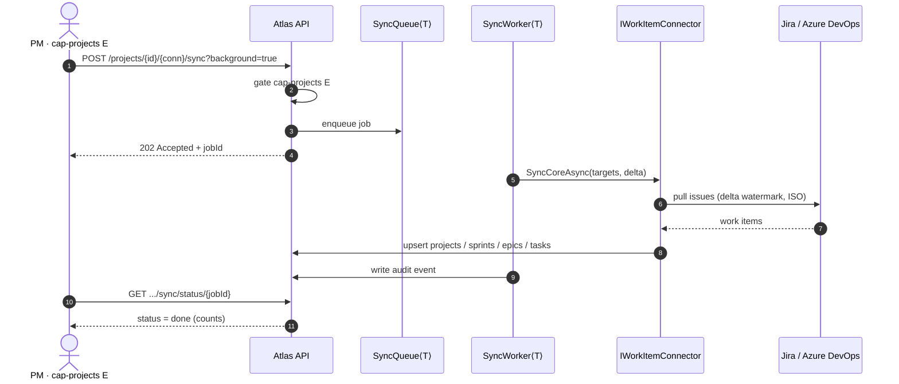
```mermaid
sequenceDiagram
  autonumber
  actor U as PM · cap-projects E
  participant API as Atlas API
  participant Q as SyncQueue⟨T⟩
  participant W as SyncWorker⟨T⟩
  participant C as IWorkItemConnector
  participant EX as Jira / Azure DevOps
  U->>API: POST /projects/{id}/{conn}/sync?background=true
  API->>API: gate cap-projects E
  API->>Q: enqueue job
  API-->>U: 202 Accepted + jobId
  W->>C: SyncCoreAsync(targets, delta)
  C->>EX: pull issues (delta watermark, ISO)
  EX-->>C: work items
  C->>API: upsert projects / sprints / epics / tasks
  W->>API: write audit event
  U->>API: GET .../sync/status/{jobId}
  API-->>U: status = done (counts)
```

## Whiteboard live co-editing

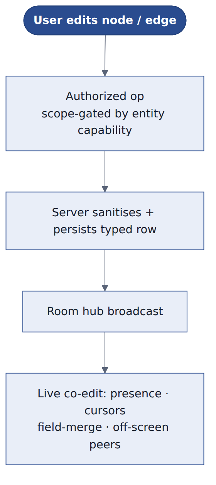

```mermaid
graph TD
  U(["User edits node / edge"]):::start --> OP["Authorized op<br/>scope-gated by entity capability"]
  OP --> SAN["Server sanitises + persists typed row"]
  SAN --> HUB["Room hub broadcast"]
  HUB --> PEERS["Live co-edit: presence · cursors<br/>field-merge · off-screen peers"]
  classDef start fill:#2a4c8f,stroke:#22407a,color:#ffffff,font-weight:600;
```

## Reports & export

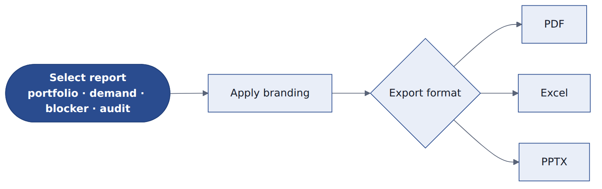

```mermaid
graph LR
  SEL(["Select report<br/>portfolio · demand · blocker · audit"]):::start --> BR["Apply branding"]
  BR --> F{"Export format"}
  F --> PDF["PDF"]
  F --> XL["Excel"]
  F --> PP["PPTX"]
  classDef start fill:#2a4c8f,stroke:#22407a,color:#ffffff,font-weight:600;
```

## Administration

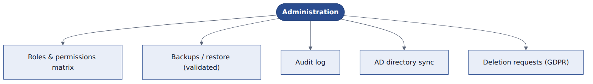

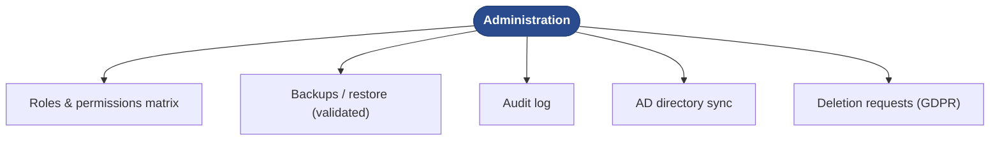
```mermaid
graph TD
  A(["Administration"]):::start --> RBAC["Roles & permissions matrix"]
  A --> BK["Backups / restore (validated)"]
  A --> AUD["Audit log"]
  A --> SY["AD directory sync"]
  A --> DEL["Deletion requests (GDPR)"]
  classDef start fill:#2a4c8f,stroke:#22407a,color:#ffffff,font-weight:600;
```

## Governance & compliance

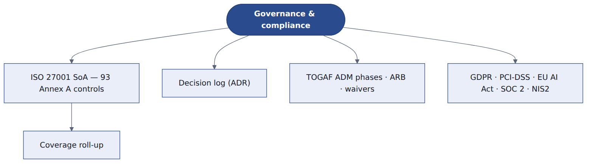

```mermaid
graph TD
  GOV(["Governance & compliance"]):::start --> SOA["ISO 27001 SoA — 93 Annex A controls"]
  GOV --> ADR["Decision log (ADR)"]
  GOV --> TG["TOGAF ADM phases · ARB · waivers"]
  GOV --> SEC["GDPR · PCI-DSS · EU AI Act · SOC 2 · NIS2"]
  SOA --> COV["Coverage roll-up"]
  classDef start fill:#2a4c8f,stroke:#22407a,color:#ffffff,font-weight:600;
```

---

# User journeys

## Executive — portfolio review

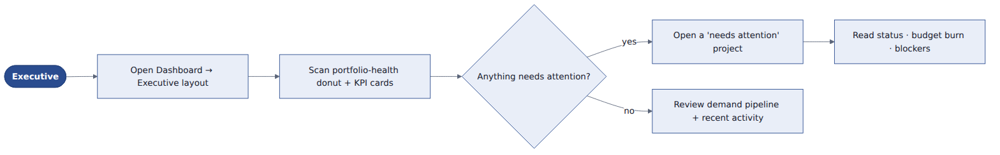

```mermaid
graph LR
  U(["Executive"]):::start --> A["Open Dashboard → Executive layout"]
  A --> B["Scan portfolio-health donut + KPI cards"]
  B --> C{"Anything needs attention?"}
  C -- yes --> D["Open a 'needs attention' project"]
  D --> E["Read status · budget burn · blockers"]
  C -- no --> F["Review demand pipeline + recent activity"]
  classDef start fill:#2a4c8f,stroke:#22407a,color:#ffffff,font-weight:600;
```

## PMO — triage & approve a demand

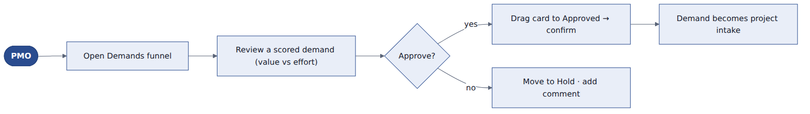

```mermaid
graph LR
  U(["PMO"]):::start --> A["Open Demands funnel"]
  A --> B["Review a scored demand (value vs effort)"]
  B --> C{"Approve?"}
  C -- yes --> D["Drag card to Approved → confirm"]
  D --> E["Demand becomes project intake"]
  C -- no --> F["Move to Hold · add comment"]
  classDef start fill:#2a4c8f,stroke:#22407a,color:#ffffff,font-weight:600;
```

## PM — create a project (wizard)

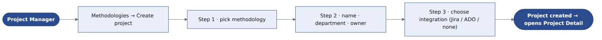

```mermaid
graph LR
  U(["Project Manager"]):::start --> A["Methodologies → Create project"]
  A --> B["Step 1 · pick methodology"]
  B --> C["Step 2 · name · department · owner"]
  C --> D["Step 3 · choose integration (Jira / ADO / none)"]
  D --> E(["Project created → opens Project Detail"]):::start
  classDef start fill:#2a4c8f,stroke:#22407a,color:#ffffff,font-weight:600;
```

## PM — manage tasks & Jira sync

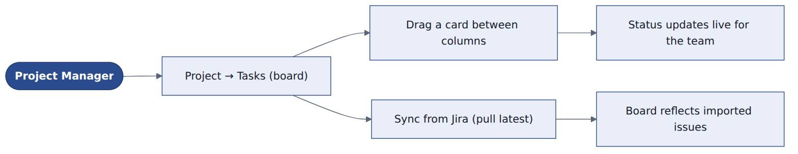

```mermaid
graph LR
  U(["Project Manager"]):::start --> A["Project → Tasks (board)"]
  A --> B["Drag a card between columns"]
  B --> C["Status updates live for the team"]
  A --> D["Sync from Jira (pull latest)"]
  D --> E["Board reflects imported issues"]
  classDef start fill:#2a4c8f,stroke:#22407a,color:#ffffff,font-weight:600;
```

## PM — request a stage-gate review

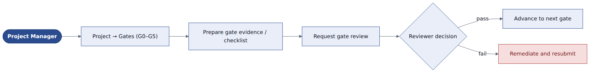

```mermaid
graph LR
  U(["Project Manager"]):::start --> A["Project → Gates (G0–G5)"]
  A --> B["Prepare gate evidence / checklist"]
  B --> C["Request gate review"]
  C --> D{"Reviewer decision"}
  D -- pass --> E["Advance to next gate"]
  D -- fail --> F["Remediate and resubmit"]:::deny
  classDef start fill:#2a4c8f,stroke:#22407a,color:#ffffff,font-weight:600;
  classDef deny fill:#f7dede,stroke:#b23a3a,color:#7a1f1f;
```

## Team member — update my work

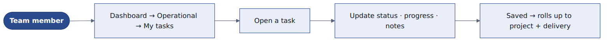

```mermaid
graph LR
  U(["Team member"]):::start --> A["Dashboard → Operational → My tasks"]
  A --> B["Open a task"]
  B --> C["Update status · progress · notes"]
  C --> D["Saved → rolls up to project + delivery"]
  classDef start fill:#2a4c8f,stroke:#22407a,color:#ffffff,font-weight:600;
```

## Stakeholder — check my status

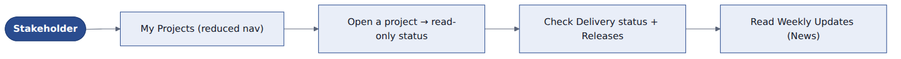

```mermaid
graph LR
  U(["Stakeholder"]):::start --> A["My Projects (reduced nav)"]
  A --> B["Open a project → read-only status"]
  B --> C["Check Delivery status + Releases"]
  C --> D["Read Weekly Updates (News)"]
  classDef start fill:#2a4c8f,stroke:#22407a,color:#ffffff,font-weight:600;
```

## Manager — My Team (skills · SWOT · dev plan)

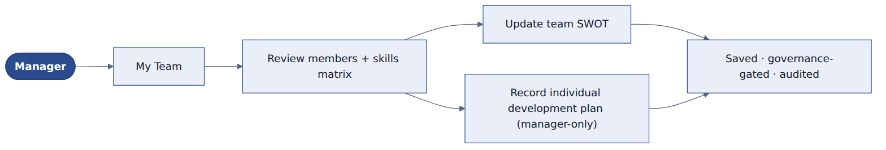

```mermaid
graph LR
  U(["Manager"]):::start --> A["My Team"]
  A --> B["Review members + skills matrix"]
  B --> C["Update team SWOT"]
  B --> D["Record individual development plan (manager-only)"]
  C --> E["Saved · governance-gated · audited"]
  D --> E
  classDef start fill:#2a4c8f,stroke:#22407a,color:#ffffff,font-weight:600;
```

## Platform Admin — administration

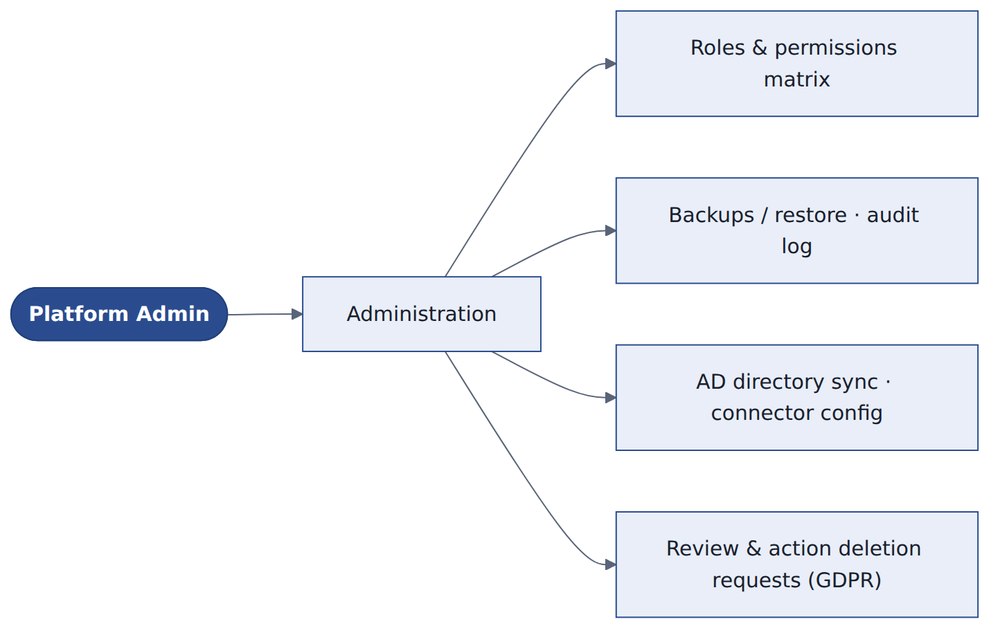

```mermaid
graph LR
  U(["Platform Admin"]):::start --> A["Administration"]
  A --> B["Roles & permissions matrix"]
  A --> C["Backups / restore · audit log"]
  A --> D["AD directory sync · connector config"]
  A --> E["Review & action deletion requests (GDPR)"]
  classDef start fill:#2a4c8f,stroke:#22407a,color:#ffffff,font-weight:600;
```

## Chief Architect — governance

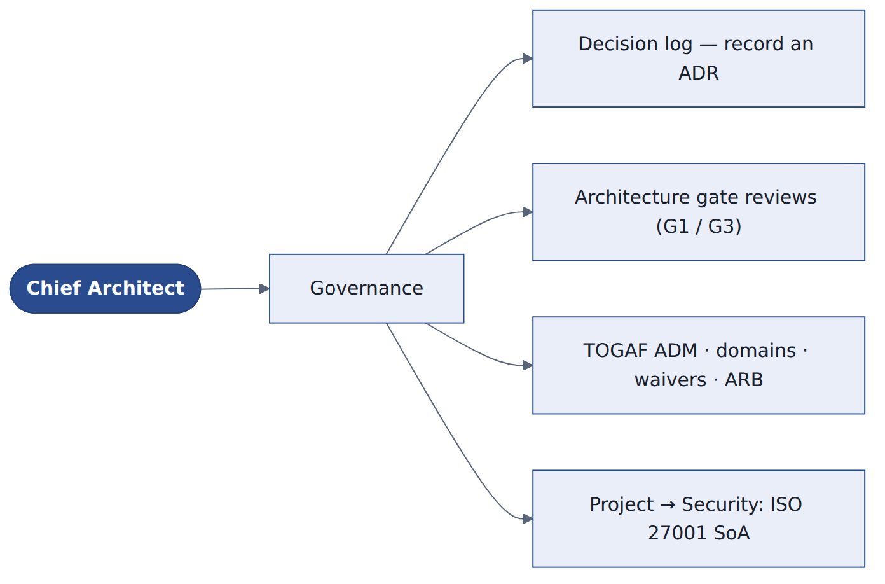

```mermaid
graph LR
  U(["Chief Architect"]):::start --> A["Governance"]
  A --> B["Decision log — record an ADR"]
  A --> C["Architecture gate reviews (G1 / G3)"]
  A --> D["TOGAF ADM · domains · waivers · ARB"]
  A --> E["Project → Security: ISO 27001 SoA"]
  classDef start fill:#2a4c8f,stroke:#22407a,color:#ffffff,font-weight:600;
```

---

# Software-development interaction

## Change lifecycle — issue → PR → merge

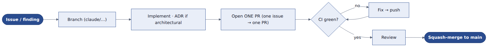

```mermaid
graph LR
  I(["Issue / finding"]):::start --> B["Branch (claude/…)"]
  B --> IMP["Implement · ADR if architectural"]
  IMP --> PR["Open ONE PR (one issue → one PR)"]
  PR --> CI{"CI green?"}
  CI -- no --> FIX["Fix → push"]
  FIX --> CI
  CI -- yes --> RV["Review"]
  RV --> M(["Squash-merge to main"]):::start
  classDef start fill:#2a4c8f,stroke:#22407a,color:#ffffff,font-weight:600;
```

## CI pipeline — the gating jobs

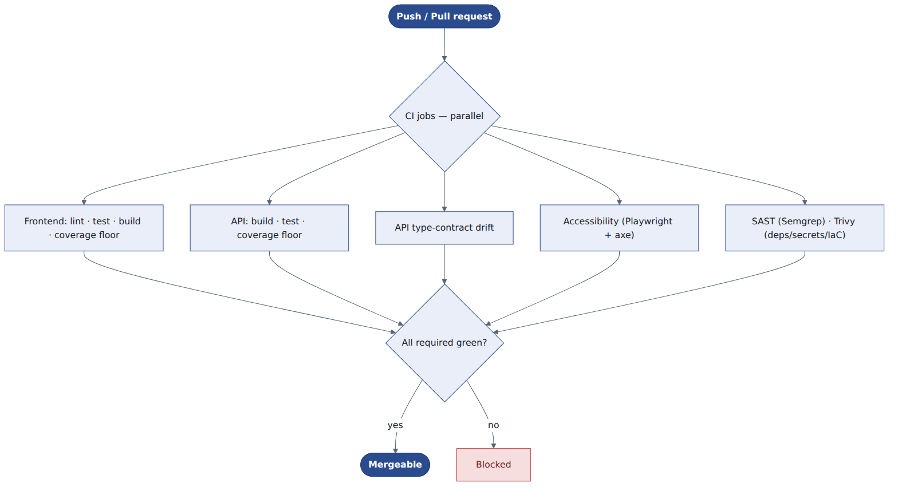

```mermaid
graph TD
  P(["Push / Pull request"]):::start --> J{"CI jobs — parallel"}
  J --> FE["Frontend: lint · test · build · coverage floor"]
  J --> BE["API: build · test · coverage floor"]
  J --> CT["API type-contract drift"]
  J --> AX["Accessibility (Playwright + axe)"]
  J --> SEC["SAST (Semgrep) · Trivy (deps/secrets/IaC)"]
  FE --> G{"All required green?"}
  BE --> G
  CT --> G
  AX --> G
  SEC --> G
  G -- yes --> MG(["Mergeable"]):::start
  G -- no --> BL["Blocked"]:::deny
  classDef start fill:#2a4c8f,stroke:#22407a,color:#ffffff,font-weight:600;
  classDef deny fill:#f7dede,stroke:#b23a3a,color:#7a1f1f;
```

## API type contract (OpenAPI → TS) + drift guard

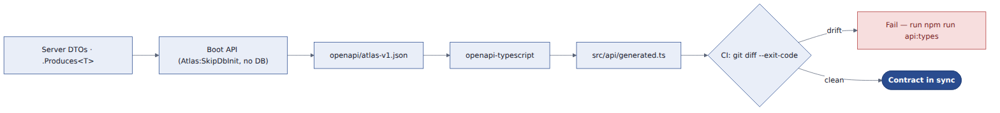

```mermaid
graph LR
  DTO["Server DTOs · .Produces&lt;T&gt;"] --> DUMP["Boot API (Atlas:SkipDbInit, no DB)"]
  DUMP --> DOC["openapi/atlas-v1.json"]
  DOC --> GEN["openapi-typescript"]
  GEN --> TS["src/api/generated.ts"]
  TS --> DIFF{"CI: git diff --exit-code"}
  DIFF -- drift --> FAIL["Fail — run npm run api:types"]:::deny
  DIFF -- clean --> OK(["Contract in sync"]):::start
  classDef start fill:#2a4c8f,stroke:#22407a,color:#ffffff,font-weight:600;
  classDef deny fill:#f7dede,stroke:#b23a3a,color:#7a1f1f;
```

## Module-boundary ratchet (ADR-0072)

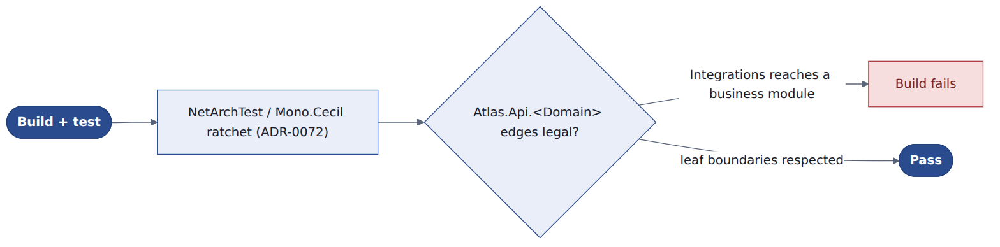

```mermaid
graph LR
  BUILD(["Build + test"]):::start --> ARCH["NetArchTest / Mono.Cecil ratchet (ADR-0072)"]
  ARCH --> CHK{"Atlas.Api.&lt;Domain&gt; edges legal?"}
  CHK -- "Integrations reaches a business module" --> FAIL["Build fails"]:::deny
  CHK -- "leaf boundaries respected" --> OK(["Pass"]):::start
  classDef start fill:#2a4c8f,stroke:#22407a,color:#ffffff,font-weight:600;
  classDef deny fill:#f7dede,stroke:#b23a3a,color:#7a1f1f;
```

## Test strategy — unit → integration → e2e → perf

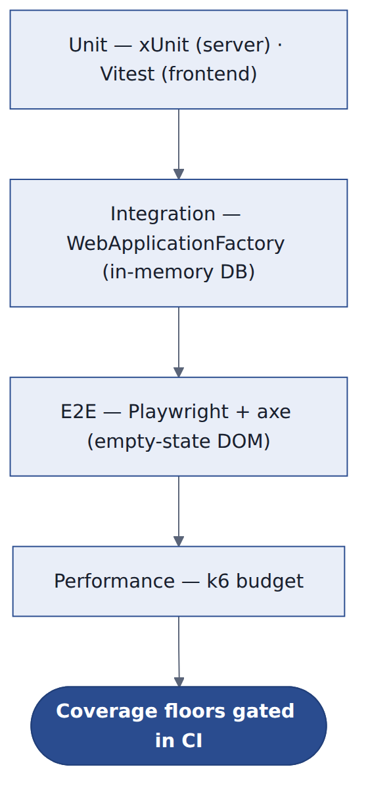

```mermaid
graph TD
  U["Unit — xUnit (server) · Vitest (frontend)"] --> I["Integration — WebApplicationFactory (in-memory DB)"]
  I --> E["E2E — Playwright + axe (empty-state DOM)"]
  E --> PF["Performance — k6 budget"]
  PF --> COV(["Coverage floors gated in CI"]):::start
  classDef start fill:#2a4c8f,stroke:#22407a,color:#ffffff,font-weight:600;
```

## Local dev loop (auth on/off)

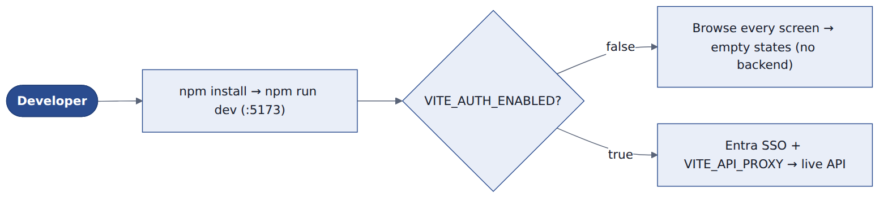

```mermaid
graph LR
  DEV(["Developer"]):::start --> A["npm install → npm run dev (:5173)"]
  A --> B{"VITE_AUTH_ENABLED?"}
  B -- false --> C["Browse every screen → empty states (no backend)"]
  B -- true --> D["Entra SSO + VITE_API_PROXY → live API"]
  classDef start fill:#2a4c8f,stroke:#22407a,color:#ffffff,font-weight:600;
```

## Build & air-gapped deploy

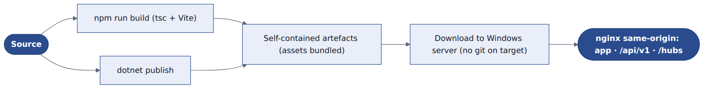

```mermaid
graph LR
  SRC(["Source"]):::start --> FE["npm run build (tsc + Vite)"]
  SRC --> BE["dotnet publish"]
  FE --> ART["Self-contained artefacts (assets bundled)"]
  BE --> ART
  ART --> DL["Download to Windows server (no git on target)"]
  DL --> NG(["nginx same-origin: app · /api/v1 · /hubs"]):::start
  classDef start fill:#2a4c8f,stroke:#22407a,color:#ffffff,font-weight:600;
```

## Runtime topology (component interaction)

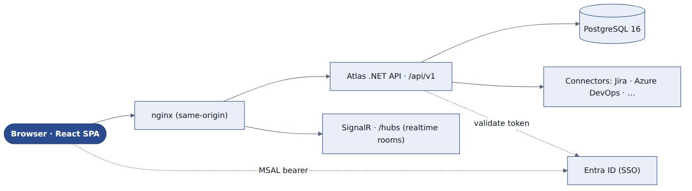

```mermaid
graph LR
  BR(["Browser · React SPA"]):::start --> NG["nginx (same-origin)"]
  NG --> API["Atlas .NET API · /api/v1"]
  NG --> HUB["SignalR · /hubs (realtime rooms)"]
  API --> DB[("PostgreSQL 16")]
  API --> EXT["Connectors: Jira · Azure DevOps · …"]
  BR -. "MSAL bearer" .-> ENTRA["Entra ID (SSO)"]
  API -. "validate token" .-> ENTRA
  classDef start fill:#2a4c8f,stroke:#22407a,color:#ffffff,font-weight:600;
```

## Extending a connector (IWorkItemConnector)

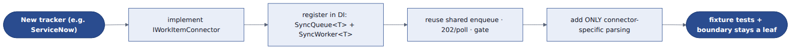

```mermaid
graph LR
  NEW(["New tracker (e.g. ServiceNow)"]):::start --> IMPL["implement IWorkItemConnector"]
  IMPL --> REG["register in DI: SyncQueue&lt;T&gt; + SyncWorker&lt;T&gt;"]
  REG --> EP["reuse shared enqueue · 202/poll · gate"]
  EP --> PARSE["add ONLY connector-specific parsing"]
  PARSE --> TST(["fixture tests + boundary stays a leaf"]):::start
  classDef start fill:#2a4c8f,stroke:#22407a,color:#ffffff,font-weight:600;
```
