# Atlas PPM — Functional Flows

Flow diagrams for each Atlas PPM functional area. Each entry shows the live
Mermaid source (renders in Confluence / GitHub) and links the static PNG in
`images/`. Sources live in `flows/`; regenerate images with the command in
`README.md`.

## Index

- [Application map & navigation](#00-app-sitemap)
- [Authentication & RBAC gate](#01-auth-rbac)
- [Dashboard — layout switching & data](#02-dashboard)
- [Demand intake → scoring → approval funnel](#03-demands)
- [Portfolio → Project drill-in](#04-portfolio-project)
- [Project stage gates (G0–G5) & reviews](#05-project-gates)
- [Task board move — realtime, cap-schedule](#06-tasks-board)
- [Timeline / Gantt & cross-entity dependencies](#07-gantt)
- [Resource utilisation & capacity](#08-resources)
- [Financials roll-up → portfolio ROI](#09-financials)
- [Program detail — stakeholder matrix](#10-programs)
- [Products → Releases → deployment](#11-products-releases)
- [OKRs — objectives, key results, linkage](#12-okrs)
- [Delivery status reporting by period](#13-delivery)
- [Weekly news wall (edit / view)](#14-news)
- [Connector sync (Jira / Azure DevOps)](#15-integrations-sync)
- [Whiteboard live co-editing](#16-whiteboard)
- [Reports & export](#17-reports)
- [Administration](#18-admin)
- [Governance & compliance](#19-governance-compliance)

## Application map & navigation

## Authentication & RBAC gate

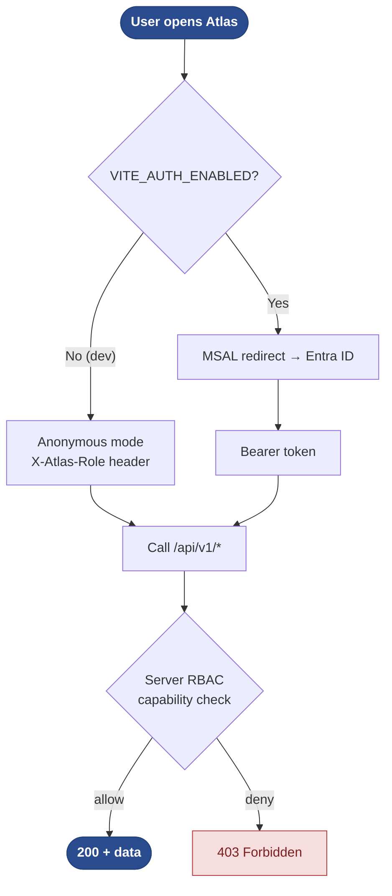

## Dashboard — layout switching & data

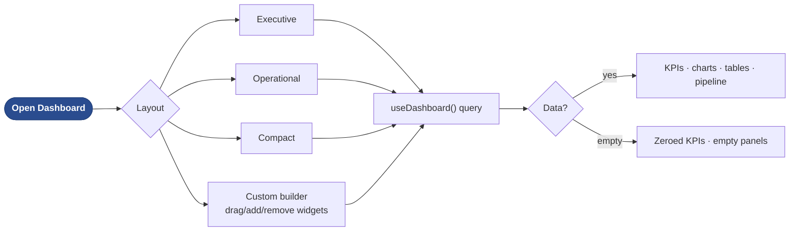

## Demand intake → scoring → approval funnel

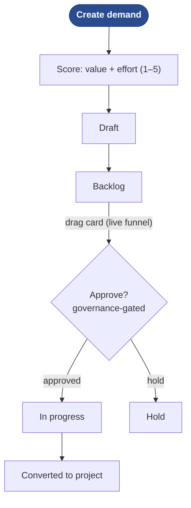

## Portfolio → Project drill-in

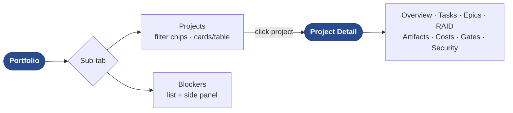

## Project stage gates (G0–G5) & reviews

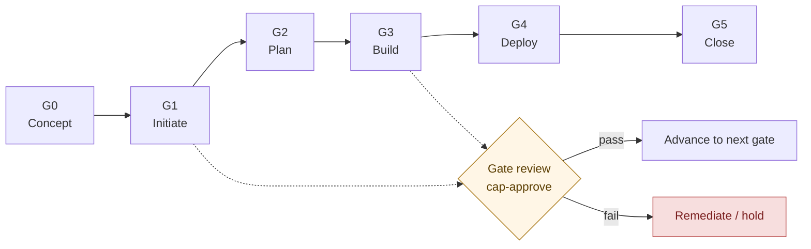

## Task board move — realtime, cap-schedule

## Timeline / Gantt & cross-entity dependencies

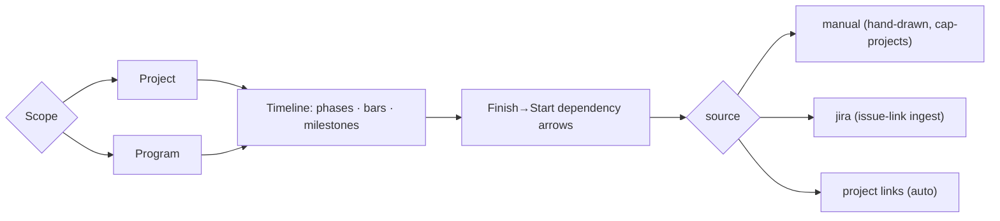

## Resource utilisation & capacity

## Financials roll-up → portfolio ROI

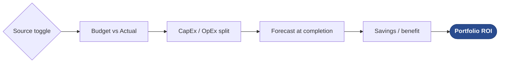

## Program detail — stakeholder matrix

## Products → Releases → deployment

## OKRs — objectives, key results, linkage

## Delivery status reporting by period

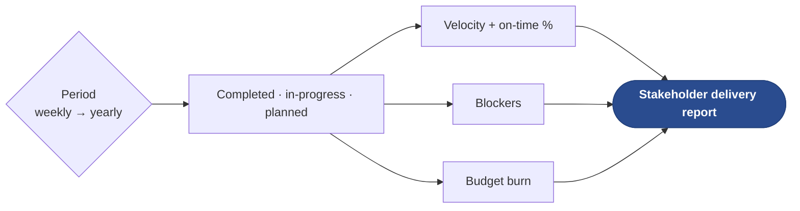

## Weekly news wall (edit / view)

## Connector sync (Jira / Azure DevOps)

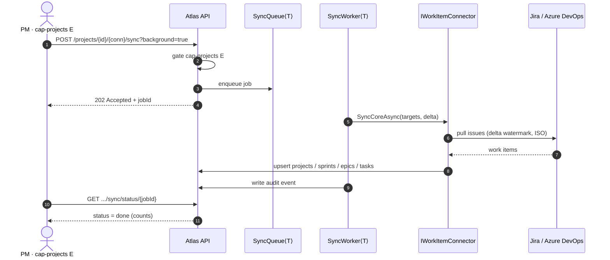

## Whiteboard live co-editing

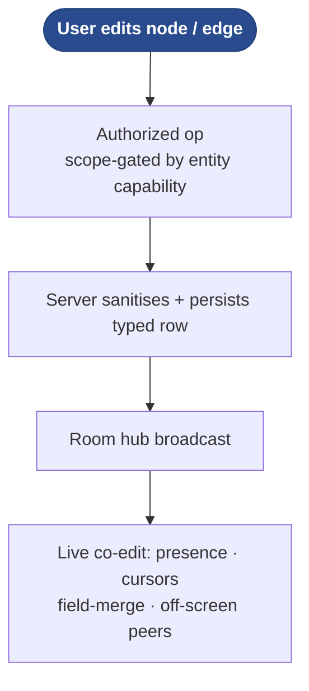

## Reports & export

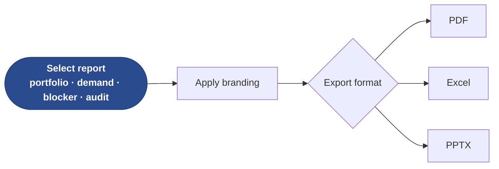

## Administration

## Governance & compliance

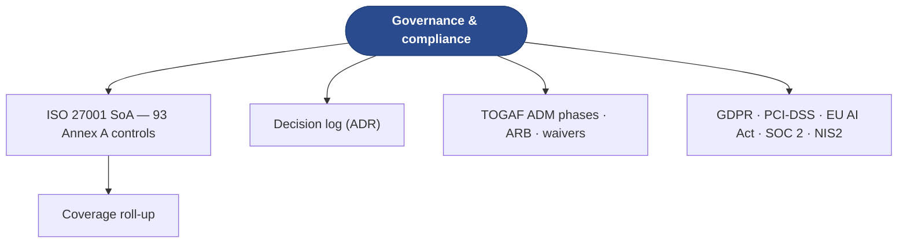
