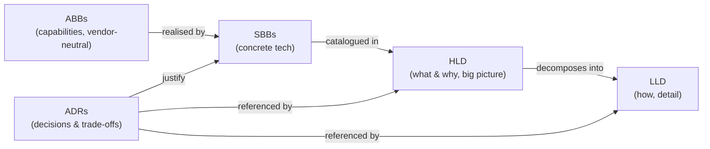

# Atlas PPM — Architecture Documentation

This folder is the **architecture reference** for Atlas PPM itself (the product), as
distinct from the in-app governance module (TOGAF ADM phases, architecture domains,
decision log and ARB sign-off) which customers use to govern *their* projects.

| Document | Purpose | Audience |
|----------|---------|----------|
| [High Level Design (HLD)](./hld.md) | System context, containers, quality attributes, integrations, deployment & security overview, with C4-style diagrams | Architects, tech leads, reviewers, security |
| [Low Level Design (LLD)](./lld.md) | Data model, module/endpoint map, RBAC internals, request lifecycle, background jobs, sync algorithms, plus decisions & trade-offs | Engineers implementing/maintaining Atlas |
| [Building Blocks (ABB / SBB)](./building-blocks.md) | TOGAF-style catalogue of Architecture Building Blocks and their Solution Building Block realisations, with a traceability matrix | Architects, procurement, assurance |
| [ADR log](./adr/) | Architecture Decision Records — each significant decision, its context, options, decision and consequences | Everyone; the "why" behind the design |
| [Requirements](../requirements.md) | Consolidated functional / non-functional / candidate requirements (SHALL/SHOULD/MAY), traced to ABB/SBB & ADRs | Product, assurance, reviewers |

## How these relate

## Conventions

- Diagrams are [Mermaid](https://mermaid.js.org/) fenced blocks so they render on
  GitHub and in most IDEs without external tooling (ADR-0011 — plain-text-first docs).
- ADRs are numbered `ADR-NNNN`, immutable once **Accepted**; a superseding ADR
  references the one it replaces.
- Terminology follows TOGAF where it helps (ABB/SBB, ADM), without ceremony.

## Status & scope

Reflects `main` as of the current release: React 18 + TypeScript SPA, .NET 10
minimal API, EF Core 10 on PostgreSQL 16, Entra ID SSO, containerised behind nginx.
Keep these documents updated in the same PR as any change that alters a container,
a trust boundary, the data model shape, or a decision recorded in an ADR.
