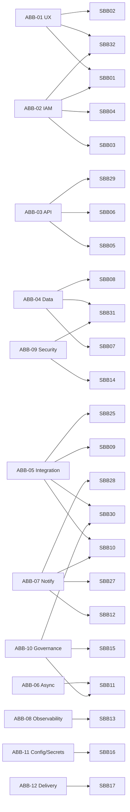

# Atlas PPM — Architecture & Solution Building Blocks

TOGAF-style catalogue. **Architecture Building Blocks (ABBs)** describe required
*capabilities* in vendor-neutral terms; **Solution Building Blocks (SBBs)** are the
concrete components that realise them in Atlas. This gives a stable capability
model even as specific technologies change, and a traceability path from
requirement → capability → implementation → decision.

## 1. Architecture Building Blocks (ABBs)

| ID | ABB (capability) | Description |
|----|------------------|-------------|
| ABB-01 | Presentation & UX | Role-aware, accessible, i18n web UI with loading/empty/error states |
| ABB-02 | Identity & Access | Authenticate users; authorise actions by role/capability |
| ABB-03 | API & Application Logic | Expose domain operations over a stable, documented contract |
| ABB-04 | Persistence | Durable, transactional, migratable storage of portfolio data |
| ABB-05 | Integration | Connect to external systems (directory, issue trackers, mail) |
| ABB-06 | Asynchronous Processing | Run scheduled/background work off the request path |
| ABB-07 | Notification & Collaboration | Notify subscribers; comments; curated updates |
| ABB-08 | Observability | Traces, metrics, logs, health, correlation of failures |
| ABB-09 | Security & Hardening | Transport security, headers/CSP, rate limiting, secrets, least-privilege |
| ABB-10 | Governance & Compliance | Stage gates, RAID, architecture/security review, decision log, GDPR |
| ABB-11 | Configuration & Secrets | Externalised, environment-specific config and secret injection |
| ABB-12 | Delivery & Runtime | Build, package, deploy and run the system reproducibly |

## 2. Solution Building Blocks (SBBs) and ABB realisation

| ID | SBB (component / technology) | Realises | Notes / ADR |
|----|------------------------------|----------|-------------|
| SBB-01 | React 18 + TypeScript + Vite SPA (inline design tokens, TanStack Query, MSAL); **selectable themes** via CSS-variable palettes (top-bar picker) — Atlas Light (default) + **Command/Daylight/Carbon** brand themes + gated Atlas Dark, `primary`/`primaryFill` split so all clear WCAG AA (axe-gated), **theme-aware charts**, **per-theme typography** (Public Sans/Space Mono · IBM Plex on brand themes) with **self-hosted/bundled fonts** (no CDN), chosen theme **saved per user server-side** (`/prefs/theme`, follows across devices; localStorage fallback signed out); **timelines on an absolute-month model with a user-selected calendar window up to 5 years** (project/programme/portfolio); **task lifecycle timeline** (created → work-started → resolved, virtualized) | ABB-01, ABB-02 | ADR-0003, ADR-0056, ADR-0058, ADR-0059, ADR-0074, ADR-0075, ADR-0076, ADR-0077, ADR-0078 |
| SBB-02 | i18n message catalogue (6 locales) | ABB-01 | completeness test |
| SBB-03 | Microsoft Entra ID (OIDC) + MSAL, with a client-side idle-logout policy (default 15 min, `VITE_AUTH_IDLE_MINUTES`) | ABB-02, ABB-09 | ADR-0005, ADR-0038 |
| SBB-04 | RBAC capability matrix (`Rbac.cs` + `Permissions.cs`); CTO/CIO roles (Executive-enforced); **regional manager identities (Infrastructure Mgr APAC, Dev APAC Mgr, BLOG IT Manager) cloning their base role's capabilities**; data-driven header switcher (created roles selectable); **need-to-know internal-labour rates — per discipline×region line, server-filtered; Platform Admin excluded entirely (no line owned, no persona-switch preview)** | ABB-02 | ADR-0004, ADR-0043, ADR-0046, ADR-0055, ADR-0057 |
| SBB-05 | .NET 10 minimal API (`/api/v1`, modular groups); **enforced module boundaries** (`Atlas.Api.<Domain>` namespaces + IL-level dependency ratchet in tests) | ABB-03 | ADR-0001, ADR-0072, ADR-0073 |
| SBB-06 | OpenAPI / Swagger (Swashbuckle) | ABB-03 | contract docs |
| SBB-07 | EF Core 10 + `AtlasDbContext` + migrations | ABB-04 | ADR-0002 |
| SBB-08 | PostgreSQL 16 | ABB-04 | ADR-0002 |
| SBB-09 | Jira connector (agile + enhanced JQL, board-optional; full-field + comments + attachments; **board auto-discovery by project key when no board id is mapped, so sprints import regardless**; **changelog import (`expand=changelog`) → task lifecycle timestamps: `StartedAt` from the earliest status transition, `ResolvedAt` from `resolutiondate`**) | ABB-05 | ADR-0006, ADR-0018, ADR-0059 |
| SBB-10 | Microsoft Graph (directory sync, Mail.Send) | ABB-05, ABB-07 | |
| SBB-11 | Hosted services (`JiraSyncService`, `RetentionHostedService`, `CapacityAlertService`, `JiraSyncWorker`+`JiraSyncQueue`, `AdoSyncWorker`+`AdoSyncQueue`); **process-role split (`Atlas__Role` web/worker/all) — recurring timer jobs run in a separate worker container off the request path** | ABB-06, ABB-10, ABB-12 | ADR-0007, ADR-0028, ADR-0030, ADR-0039, ADR-0048 |
| SBB-12 | Notifications service + subscriptions + comments + over-allocation alerts; role-addressed demand alerts (PMO/Architect/CTO/CIO/PM Lead) with per-role email via the in-app group→role mapping + per-person opt-out; **Microsoft Teams channel notifications** (Incoming-webhook + Adaptive Card, masked-secret status) as a third channel | ABB-07 | ADR-0028, ADR-0043, ADR-0045, ADR-0060 |
| SBB-13 | OpenTelemetry (OTLP) + health/readiness + correlation IDs + reference Grafana/Tempo/Prometheus/Loki stack; domain metrics (sync duration, queue depth, capacity alerts, DB command duration) with tuned dashboards (overview + operations) & Prometheus alert rules | ABB-08 | ADR-0010, ADR-0032, ADR-0040 |
| SBB-14 | Security headers/CSP, rate limiter, upload limits, least-privilege DB role, non-root API image; **gating** AppSec scanning — SAST (Semgrep) · SCA/secrets/IaC (Trivy) in CI (triaged baseline) + on-demand DAST (OWASP ZAP); portable `scripts/security-scan.sh` (runs off GitHub) + in-app **Admin → Security Posture** | ABB-09, ABB-12 | ADR-0008, ADR-0051, ADR-0053, security-hardening.md |
| SBB-15 | Governance modules (Gates, RAID, Architecture ADM/ARB, Security controls, Decisions, Quality) + GDPR/retention; **deterministic risk engine** (`Risks.cs`, no LLM) mapping findings to GDPR/ISO 27001/ISO 42001/PCI-DSS/SOC 2/NIS2/NIST CSF/MITRE ATT&CK with a generic per-framework coverage rule; **EU AI Act risk-tiering + ISO 42001 AI-management** (tier→obligation rules: Art 5/6/9/10/14/50); **Zero-Trust posture** mapping; **ISO 27001:2022 Statement of Applicability** (full 93-control Annex A catalogue + per-project applicability/status + coverage roll-up) | ABB-10, ABB-09 | ADR-0049, ADR-0050, ADR-0066 |
| SBB-16 | `IConfiguration` env + Docker secrets tooling (`Secrets.cs`: KeyPerFile `/run/secrets`, optional Azure Key Vault); **OpenBao/HashiCorp Vault KV-v2 provider** (`OpenBao.cs`, inert-until-configured, non-fatal, precedence above the file layer); **passwordless Postgres via TLS client-certificate auth** (`deploy/gen-pg-cert.sh` + `pg_hba` `cert clientcert=verify-full` + `docker-compose.pgcert.yml`, no DB password, zero app-code) | ABB-11, ABB-09 | ADR-0009, ADR-0067, ADR-0069 |
| SBB-17 | **On-prem single-node Docker** (`docker compose`: api=web + worker + db + nginx edge, one image/role) as the supported delivery target (k8s parked); GitHub Actions CI (+ on-demand perf-smoke gate); **tag-triggered release pipeline publishing versioned api/web images to GHCR (Buildx + Trivy image scan)** — hosts pull & recreate, config via env/Docker secrets | ABB-12 | ADR-0008, ADR-0048, ADR-0052, ADR-0054 |
| SBB-18 | Time-phased allocation (`TeamAssignmentMember` segments, `AllocMath`) + availability finder (`/resources/availability`) | ABB-06 | ADR-0013 |
| SBB-19 | Ops module (`OpsService`/`OpsItem`, `cap-ops`, project-impact + Ops% roll-up; full-fidelity Jira import — epics as items + rich fields + comments/attachments; work-item-status filter; multi-select bulk delete; linked project tasks `OpsTaskLink`) | ABB-05, ABB-06, ABB-10 | ADR-0014, ADR-0034, ADR-0042 |
| SBB-20 | Skills & competency matrix (`Skill`/`SkillRating`, name-keyed); **manager-scoped** — visible only to a team's manager (or Platform Admin), skills owned per manager slot (`Skill.Team`) so a manager sees only their own team's columns + legacy shared ones; per-team create uniqueness, scope-checked rename/delete/rating, scoped export | ABB-06, ABB-02 | ADR-0016 |
| SBB-21 | Colour-graded Excel exports (ClosedXML: allocation histogram, skills matrix) | ABB-06, ABB-01 | ADR-0015 |
| SBB-22 | GDPR data-subject admin surface (DSAR export, erase, run-retention) | ABB-10 | ADR-0017 |
| SBB-23 | Strategic roadmap (`RoadmapItem` + milestones/links/deps, `cap-roadmap`, Now/Next/Later board + **By-year board** + timeline) | ABB-06 | ADR-0019 |
| SBB-24 | Task-estimate allocation engine (`AllocationEngine`: max(planned, task) per project; shared by Resources + capacity); **period-windowed roster** — `GET /resources` `from`/`to` averages each person's per-working-day load over the window via shared in-memory helpers (`ProjectPlannedFor`/`TaskLoadFor`/`CombineProjectLoad`) reused by the snapshot, the window and the Excel export so they can't drift; UI period toggle + date-range filter | ABB-06 | ADR-0020, ADR-0071 |
| SBB-25 | Azure DevOps connector (`AzureDevOps.cs`: PAT auth, status/test, discovery + import/map `Project.AdoProject`, **work-item sync** — WIQL work items → epics/tasks, iterations → sprints, idempotent by `AdoId`; **background queue/worker**; **delta/changed-since pulls** via `LastAdoSync` + WIQL `[System.ChangedDate]`) | ABB-05, ABB-06 | ADR-0035, ADR-0036, ADR-0039, ADR-0044 |
| SBB-26 | k6 performance/load suite (`perf/`: smoke·load·stress + public-API volume seeder; env-driven URL/auth; hot roll-up endpoints; Prometheus remote-write into the reference stack) | ABB-08, ABB-12 | ADR-0047 |
| SBB-27 | **Real-time collaboration hub** (`BoardHub`, SignalR over `/hubs/board`): opaque scope "rooms" (pi · demands · wb · tasks) carry live presence, peer cursors, off-screen peer indicators and change/op pings; server-only op broadcast (clients can't send ops) so peers render only server-authorized deltas; open to all roles (writes stay capability-gated) | ABB-07, ABB-01 | ADR-0061, ADR-0065 |
| SBB-28 | **Freeform whiteboard** (`Whiteboards.cs` + `src/whiteboard/*`): per-entity brainstorming canvas — sticky notes, rich shape set, arrow connectors, icons, actors, freehand pen, templates (mind map/fishbone/methodologies); typed-row persistence (`WhiteboardNode`/`WhiteboardEdge`, per-row co-editing ops); scope→capability gate + server sanitisation; PNG/SVG/JSON export/import; keyboard-operable canvas | ABB-07, ABB-01, ABB-04 | ADR-0064 |
| SBB-29 | **Cross-entity timeline dependencies** (`Dependencies.cs`, `TimelineDependency`: `fromType/fromId → toType/toId`, source manual\|jira\|project across project/program/product/release/sprint): finish-to-start arrows on the Portfolio timeline (hand-drawn + existing project links folded in), sprint-level arrows on the Project (editable) & Program (read-only) timelines via a DOM-measurement SVG overlay; **Jira issue-link ingest** derives sprint→sprint edges from cross-sprint blocks/depends links (reuses the Jira sync client, idempotent, guarded) | ABB-03, ABB-01, ABB-05 | ADR — timeline deps |
| SBB-30 | **Quality test-task detail + Jira board ingest** (`Quality.cs`, `TestPlanTask` gains description/start/due/estimate-hours/JiraKey; `TestPlan.JiraBoardId`): a full test-task window and a linked Jira agile board whose issues ingest as test tasks (reuses the Jira sync client/paging/parsing, idempotent by issue key, prunes vanished, `cap-quality`, audited) | ABB-05, ABB-10, ABB-01 | ADR-0018 |
| SBB-31 | **Personnel-notes field encryption** (`PersonnelCrypto.cs`, AES-256-GCM, per-value nonce, `enc:v1:` marker): the DPIA-gated Team-SWOT + development-plan values encrypted at rest with a key from the secret layer (`Personnel:EncryptionKey`, never in the DB); inert-until-set, legacy-plaintext passthrough, two-key rotation, fail-closed; opt-in `docker-compose.personnel.yml` mounts the key | ABB-09, ABB-10, ABB-04 | ADR-0068 |
| SBB-32 | **Project delivery roles** (`Assignments.cs`, `RoleAssignment`): a People & roles *Delivery roles* group — Technical Lead (always) + Scrum Master (agile-only, server-decided from `Project.Methodology`); candidates from the **onboarded roster** (resource directory + Entra members), not a mapped team; assignable by `admin`/`pmo`/`pm`/`pmlead`, audited; `AssignmentsDto` gains `CanAssignDelivery`+`DeliveryRoles` | ABB-01, ABB-02 | ADR-0070 |

## 3. Traceability (ABB → SBB)

## 4. Gaps & roadmap building blocks

| ABB | Gap | Planned SBB |
|-----|-----|-------------|
| ABB-05 Integration | Jira + Graph + **Azure DevOps** (discovery · import · work-item sync, ADR-0035/0036) implemented | ServiceNow / ManageEngine SDP / GitHub / Confluence / Teams / Slack / Power BI (each mirrors the Jira/ADO pattern) |
| ABB-01 UX | a11y baseline (ADR-0025) + jsdom axe over primitives + mobile drawer (ADR-0026) + **browser-based full-page axe sweep + full user-journey e2e** (Playwright: navigation, role-nav, dashboard layouts, mocked demand drill-in) & extracted per-screen logic tests (ADR-0033); token greys lifted to WCAG AA and **colour-contrast now gated** alongside structural rules (ADR-0037); **keyboard/AT operation of the pointer-first surfaces** — whiteboard canvas (focusable labelled nodes, arrow-move/edit/delete) and the Kanban/funnel drag boards (focus + arrow-move); **axe now covers the whiteboard canvas + Tasks Kanban + PI Program boards, and deterministic native-DnD drag e2e drives both boards** | Extend swept routes & journeys as new high-traffic views land (board/whiteboard axe + board drag e2e now in place) |

These map to the roadmap tracked with the product team; each will get an ADR when
a concrete technology is chosen.
