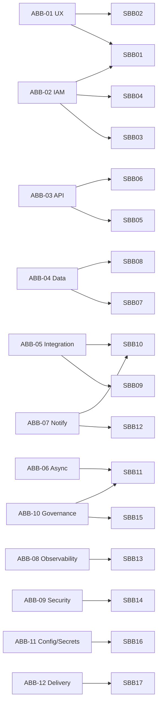

# Atlas PPM — Architecture & Solution Building Blocks

TOGAF-style catalogue. **Architecture Building Blocks (ABBs)** describe required
*capabilities* in vendor-neutral terms; **Solution Building Blocks (SBBs)** are the
concrete components that realise them in Atlas. This gives a stable capability
model even as specific technologies change, and a traceability path from
requirement → capability → implementation → decision.

## 1. Architecture Building Blocks (ABBs)

| ID | ABB (capability) | Description |
|----|------------------|-------------|
| ABB-01 | Presentation & UX | Role-aware, accessible, i18n web UI with loading/empty/error states |
| ABB-02 | Identity & Access | Authenticate users; authorise actions by role/capability |
| ABB-03 | API & Application Logic | Expose domain operations over a stable, documented contract |
| ABB-04 | Persistence | Durable, transactional, migratable storage of portfolio data |
| ABB-05 | Integration | Connect to external systems (directory, issue trackers, mail) |
| ABB-06 | Asynchronous Processing | Run scheduled/background work off the request path |
| ABB-07 | Notification & Collaboration | Notify subscribers; comments; curated updates |
| ABB-08 | Observability | Traces, metrics, logs, health, correlation of failures |
| ABB-09 | Security & Hardening | Transport security, headers/CSP, rate limiting, secrets, least-privilege |
| ABB-10 | Governance & Compliance | Stage gates, RAID, architecture/security review, decision log, GDPR |
| ABB-11 | Configuration & Secrets | Externalised, environment-specific config and secret injection |
| ABB-12 | Delivery & Runtime | Build, package, deploy and run the system reproducibly |

## 2. Solution Building Blocks (SBBs) and ABB realisation

| ID | SBB (component / technology) | Realises | Notes / ADR |
|----|------------------------------|----------|-------------|
| SBB-01 | React 18 + TypeScript + Vite SPA (inline design tokens, TanStack Query, MSAL) | ABB-01, ABB-02 | ADR-0003 |
| SBB-02 | i18n message catalogue (6 locales) | ABB-01 | completeness test |
| SBB-03 | Microsoft Entra ID (OIDC) + MSAL | ABB-02 | ADR-0005 |
| SBB-04 | RBAC capability matrix (`Rbac.cs` + `Permissions.cs`) | ABB-02 | ADR-0004 |
| SBB-05 | .NET 8 minimal API (`/api/v1`, modular groups) | ABB-03 | ADR-0001 |
| SBB-06 | OpenAPI / Swagger (Swashbuckle) | ABB-03 | contract docs |
| SBB-07 | EF Core 8 + `AtlasDbContext` + migrations | ABB-04 | ADR-0002 |
| SBB-08 | PostgreSQL 16 | ABB-04 | ADR-0002 |
| SBB-09 | Jira connector (agile + enhanced JQL, board-optional; full-field + comments + attachments) | ABB-05 | ADR-0006, ADR-0018 |
| SBB-10 | Microsoft Graph (directory sync, Mail.Send) | ABB-05, ABB-07 | |
| SBB-11 | Hosted services (`JiraSyncService`, `RetentionHostedService`) | ABB-06, ABB-10 | ADR-0007 |
| SBB-12 | Notifications service + subscriptions + comments | ABB-07 | |
| SBB-13 | OpenTelemetry (OTLP) + health/readiness + correlation IDs | ABB-08 | ADR-0010 |
| SBB-14 | Security headers/CSP, rate limiter, upload limits, least-privilege DB role | ABB-09 | ADR-0008, security-hardening.md |
| SBB-15 | Governance modules (Gates, RAID, Architecture ADM/ARB, Security controls, Decisions, Quality) + GDPR/retention | ABB-10 | |
| SBB-16 | `IConfiguration` env + Docker secrets tooling | ABB-11 | ADR-0009 |
| SBB-17 | Docker + docker-compose + nginx edge; GitHub Actions CI | ABB-12 | ADR-0008 |
| SBB-18 | Time-phased allocation (`TeamAssignmentMember` segments, `AllocMath`) + availability finder (`/resources/availability`) | ABB-06 | ADR-0013 |
| SBB-19 | Ops module (`OpsService`/`OpsItem`, `cap-ops`, project-impact + Ops% roll-up) | ABB-06, ABB-10 | ADR-0014 |
| SBB-20 | Skills & competency matrix (`Skill`/`SkillRating`, name-keyed) | ABB-06 | ADR-0016 |
| SBB-21 | Colour-graded Excel exports (ClosedXML: allocation histogram, skills matrix) | ABB-06, ABB-01 | ADR-0015 |
| SBB-22 | GDPR data-subject admin surface (DSAR export, erase, run-retention) | ABB-10 | ADR-0017 |
| SBB-23 | Strategic roadmap (`RoadmapItem` + milestones/links/deps, `cap-roadmap`, Now/Next/Later board + timeline) | ABB-06 | ADR-0019 |

## 3. Traceability (ABB → SBB)

## 4. Gaps & roadmap building blocks

| ABB | Gap | Planned SBB |
|-----|-----|-------------|
| ABB-05 Integration | Only Jira + Graph implemented | Azure DevOps connector (next), then ServiceNow / ManageEngine SDP / GitHub / Confluence / Teams / Slack / Power BI |
| ABB-08 Observability | Dashboards not shipped | Reference Grafana/Tempo/Loki stack wiring |
| ABB-01 UX | Frontend test depth + formal a11y/responsive audit | Expanded Vitest coverage + WCAG pass |

These map to the roadmap tracked with the product team; each will get an ADR when
a concrete technology is chosen.
