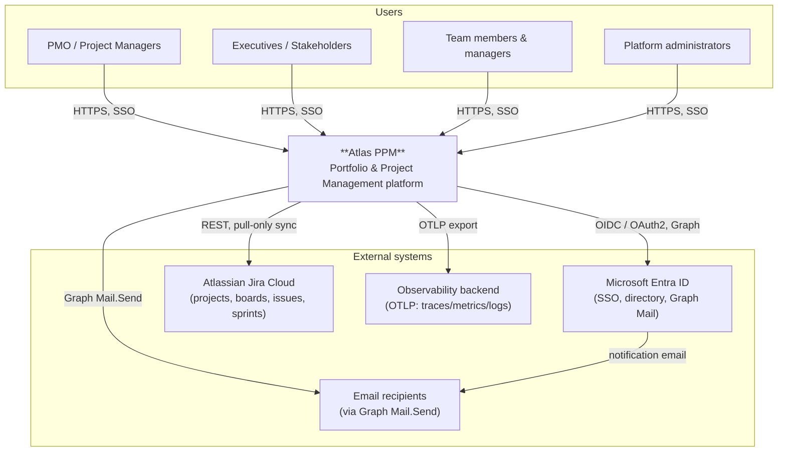
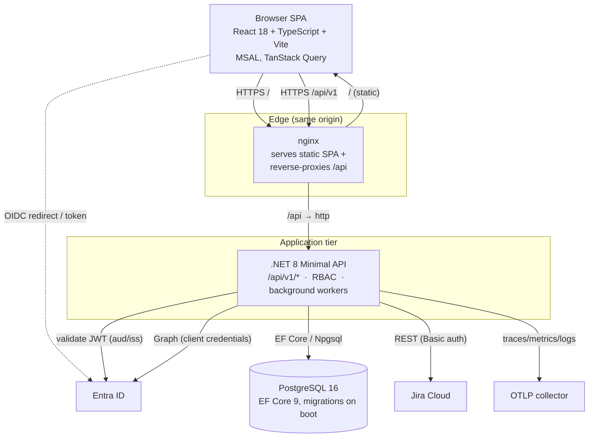
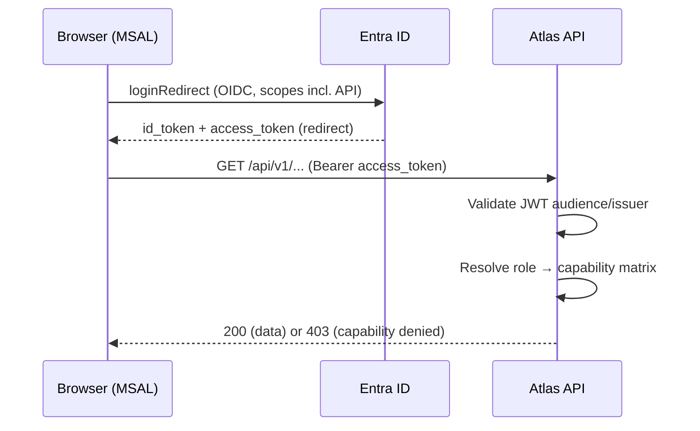
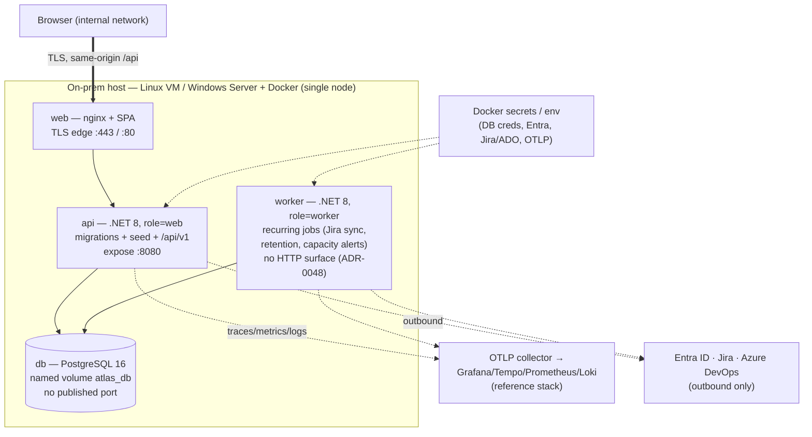
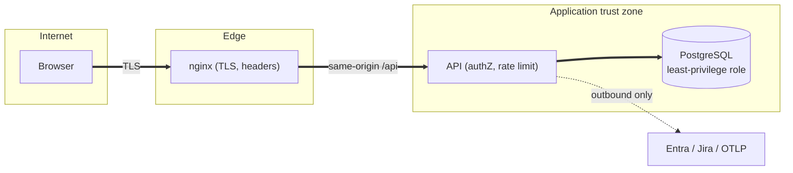

# Atlas PPM — High Level Design (HLD)

> Companion to the [LLD](./lld.md), [Building Blocks](./building-blocks.md) and [ADRs](./adr/).
> This document is the "big picture": what Atlas is, how it is structured into
> deployable containers, how it integrates, and the quality attributes it targets.

## 1. Purpose & context

Atlas PPM is a **Portfolio & Project Management** platform for Birgma / Biltema
Group (Nordic retail). It unifies demand intake, portfolio/program/product
management, OKRs, scheduling (Gantt, sprints, Program Increment planning),
resources & capacity, financials, delivery reporting, releases and governance
(stage gates, RAID, architecture/security review, decision logs) behind one
role-aware web application, backed by a REST API and integrations with the
organisation's existing tooling (Entra ID, Jira).

### 1.1 System context (C4 — Level 1)



**Key points**
- Atlas is the system of record for portfolio/governance data; **Jira sync is
  pull-only** — Atlas never writes issues back automatically (ADR-0006).
- Entra ID is authoritative for **identity** and the **directory** (people who
  can be onboarded/allocated); Atlas maps directory groups to manager slots.
- Authentication is delegated to Entra (OIDC); **authorization is enforced by
  Atlas** against a DB-backed capability matrix (ADR-0004).

## 2. Container view (C4 — Level 2)



Three containers plus the database:

| Container | Tech | Responsibility |
|-----------|------|----------------|
| **web** | nginx + built SPA assets | Serve the SPA; reverse-proxy `/api` to the API so the browser is same-origin (no CORS in prod); apply security headers |
| **api** | .NET 8 minimal API (Kestrel) | REST surface under `/api/v1`, authN/Z, business logic, EF Core persistence, background sync/retention workers |
| **db** | PostgreSQL 16 | Durable store; EF Core migrations applied automatically at API start |

Deployed via `docker-compose.yml` (`db`, `api`, `web`) with a `docker-compose.secrets.yml`
overlay for Docker-secret injection. See [DOCKER.md](../DOCKER.md) and [SETUP.md](../SETUP.md).

## 3. Component overview (API — C4 Level 3, logical)

The API is a modular monolith: one process, cohesive endpoint groups mapped under
`/api/v1` (see `Endpoints.cs → MapAtlasEndpoints`). Grouped by domain:

```mermaid
flowchart LR
  subgraph API[".NET 8 Minimal API"]
    direction TB
    delivery["Delivery\nProjects · Tasks · Sprints · Epics\nGantt/Phases/Milestones · PIP"]
    portfolio["Portfolio\nPrograms · Products · Releases · OKRs · Demands"]
    ops["Ops (run-the-business)\nOpsService · OpsItem · project-impact"]
    people["People & capacity\nTeams/Entra · SubTeams · time-phased Allocation · Resources · Availability · Skills"]
    govern["Governance\nGates · RAID · Architecture(ADM/ARB) · Security · Quality · Decisions"]
    finance["Financials\nBudgets · Costs · ROI"]
    comms["Comms\nNotifications · News · Delivery reports · Comments"]
    platform["Platform\nRBAC · Audit · Backups · Help · GDPR/Retention · Excel exports · Secrets"]
    integr["Integrations\nJira (full-field sync + attachments + scheduled worker)"]
  end
  xcut["Cross-cutting:\nPermissions · Logging/correlation · RateLimiter · Telemetry · Health"]
  API --- xcut
  API --> EF["EF Core 9 / AtlasDbContext"] --> PG[("PostgreSQL")]
```



Cross-cutting services wrap every request: `Permissions` (authorization),
request logging with correlation IDs, rate limiting, OpenTelemetry, and
health/readiness probes. Details in the [LLD §2–§6](./lld.md).

## 4. Key runtime scenarios

### 4.1 Sign-in (Entra SSO, when `Auth:Enabled`)



If auth is misconfigured (enabled but no tenant/audience) the API **fails fast at
startup** by design, rather than serving unauthenticated (ADR-0005, ADR-0008).

### 4.2 Jira sync (pull-only, board-optional)

```mermaid
sequenceDiagram
  participant Trigger as Trigger (manual button / project-link / scheduled worker)
  participant A as Atlas API
  participant J as Jira Cloud
  Trigger->>A: sync project (has JiraProjectKey)
  alt board id mapped
    A->>J: GET agile board sprints / epics / issues
  else no board id
    A->>J: GET board?projectKeyOrId=KEY → discover scrum boards → their sprints
    A->>J: GET enhanced JQL search (project = KEY), derive epics from Epic-type issues
  end
  J-->>A: issues + sprints (board-mapped or key-discovered)
  A->>A: Upsert tasks/epics/sprints; prune removed; flag non-onboarded assignees
  A-->>Trigger: SyncResult (counts, warnings)
```

Three sync paths converge on `Jira.SyncProjectAsync`: the manual **Sync** button,
an automatic one-shot when a project's Jira key is set, and a scheduled background
worker (`JiraSyncService`, default every 30 min). See [LLD §7](./lld.md).

### 4.3 Azure DevOps sync (pull-only)

```mermaid
sequenceDiagram
  participant Trigger as Trigger (Sync button, per-project or all-mapped)
  participant A as Atlas API
  participant D as Azure DevOps
  Trigger->>A: sync project (has AdoProject)
  A->>D: GET classification nodes (iterations) → sprints
  A->>D: POST WIQL (ids for TeamProject) → GET work items (batched, 200/req)
  D-->>A: iterations + work items (fields)
  A->>A: Upsert epics (type Epic) & tasks by ADO id; parent→epic; iteration→sprint; prune removed
  A-->>Trigger: counts (sprints, epics, tasks, backlog, truncated)
```

`AzureDevOps.SyncProjectAsync` mirrors the Jira engine's contract (one-way,
idempotent by ADO id, prune-on-full-pull) but keys on `Project.AdoProject`.
Two entry points: **per-project** (`POST /projects/{id}/ado/sync`) and
**all-mapped** (`POST /integrations/ado/sync`). See [LLD §7](./lld.md) and
[ADR-0036](./adr/0036-azure-devops-work-item-sync.md).

## 5. Quality attributes (how the design serves them)

| Attribute | Approach |
|-----------|----------|
| **Security** | Entra SSO (OIDC); server-authoritative RBAC capability matrix; CSP + security headers; per-client rate limiting; upload limits; secrets via Docker secrets / env, never committed; least-privilege DB role; audit log of governance actions. See [security-hardening.md](../security-hardening.md). |
| **Privacy / compliance** | GDPR DSAR export + retention/anonymisation job; in-app compliance module (GDPR, ISO 27001, SOC 2, NIS2, EU AI Act, PCI-DSS, DPP/PPWR/EUDR). |
| **Availability / resiliency** | Stateless API (scale horizontally); DB connection resiliency + real `/health` (liveness) and `/health/ready` (DB reachable) probes; best-effort integrations never block core writes. |
| **Performance / scalability** | SPA + CDN-friendly static assets; TanStack Query client caching; paged Jira reads; background sync off the request path; DB indexed on hot lookups. |
| **Observability** | OpenTelemetry traces/metrics/logs over OTLP; correlation IDs stamped on unexpected errors and surfaced to users for support. See [observability.md](../observability.md). |
| **Maintainability** | Modular monolith with cohesive endpoint groups; typed DTOs; xUnit integration tests (`WebApplicationFactory` + InMemory); frontend lint/test/build in CI. |
| **Usability / accessibility** | Role-aware navigation; loading/empty/error states everywhere; empty-by-default (no fabricated data); keyboard-operable modals, ≥44px hit targets, `aria-*`. |
| **Internationalisation** | Message catalogue across 6 locales (en/sv/fi/da/no/fr); a test guarantees every screen has a translatable label/subtitle. |

## 6. Integrations

| System | Direction | Protocol / auth | Notes |
|--------|-----------|-----------------|-------|
| **Entra ID (identity)** | Atlas ← Entra | OIDC / OAuth2 (MSAL) | SSO; MFA enforced via Conditional Access |
| **Entra ID (directory)** | Atlas ← Graph | Graph, app credentials | Group + member sync → manager slots |
| **Entra ID (mail)** | Atlas → Graph | Graph `Mail.Send` | Notification email (best-effort) |
| **Jira Cloud** | Atlas ← Jira | REST, Basic (email + API token) | Pull-only; board-optional; discovery + import |
| **Azure DevOps** | Atlas ← ADO | REST, Basic (`:PAT`) | Pull-only; discovery + import + work-item sync (WIQL → work items, iterations → sprints) |
| **Observability** | Atlas → OTLP | OTLP gRPC/HTTP | Traces, metrics, logs |

**Advertised-but-not-yet-implemented connectors** (config UI present, no backend
sync): ServiceNow, ManageEngine SDP, GitHub, Confluence, Teams, Slack, Power BI.
Tracked as roadmap; each will mirror the Jira / Azure DevOps connector pattern.

## 7. Deployment topology

The supported target is **on-prem single-node Docker** (`docker compose`) on a
Linux VM or Windows Server, kept off the public internet (ADR-0054). One host runs
four services; production pulls the versioned `api`/`web` images published to GHCR
by the release pipeline (ADR-0052) rather than building on the host.



- **Four services on one node:** `web` (nginx TLS edge, same-origin `/api` → api),
  `api` (role=web — owns EF migrations + reference-data seed, serves `/api/v1`),
  `worker` (role=worker — recurring background jobs off the request path,
  ADR-0048), `db` (Postgres 16 on a named volume, **no published port** — reachable
  only inside the host). The smallest installs collapse to a single container
  (`api` role=`all`, no `worker`).
- **Images are promoted, not rebuilt:** hosts `docker compose pull` the GHCR
  images (ADR-0052); upgrades are pull-and-recreate, health-gated by `/readyz`
  (the api applies migrations on startup).
- **Config via environment / Docker secrets** (12-factor), never in VCS. See
  [secrets.md](../secrets.md) and [security-hardening.md](../security-hardening.md).
- **No GitHub↔app path at runtime:** CI (scanners, release build) runs in GitHub;
  the deployed app only talks to its DB, the configured directory/issue trackers,
  and its OTLP collector.
- **Kubernetes is parked, not missing** (ADR-0054): the 12-factor images already
  suit k8s if a future multi-node/HA need appears, but a control plane to run four
  containers on one node isn't justified at portfolio scale.
- Supported hosts (**Linux VM**, **Windows Server** + Docker) have step-by-step
  install guides in the in-app Help centre.

## 8. Security & trust boundaries (overview)



- The DB is never exposed to the browser; only the API holds its credentials.
- The browser reaches the API same-origin through nginx (no CORS in prod).
- Outbound integration calls are the only egress from the trust zone.
- **Secrets** come from a layered provider stack (Docker `/run/secrets` →
  optional Azure Key Vault → optional on-prem **OpenBao/Vault** KV v2), each
  inert-until-configured; the vaulted value wins and a vault read failure is
  non-fatal (ADR-0067).
- **Database credential** can be eliminated entirely: **passwordless Postgres**
  via TLS client-certificate auth (the API presents a client cert whose CN is the
  DB role; no password in the connection string), verified against real Postgres
  (ADR-0069).
- **Data at rest**: the DPIA-gated personnel notes (Team SWOT + development plans)
  are encryptable with AES-256-GCM using a key from the secret layer that is never
  stored in the DB, so a stolen DB/backup yields only ciphertext (ADR-0068). Pairs
  with host disk encryption + the least-privilege DB role.
- Full control set: [security-hardening.md](../security-hardening.md),
  [secrets.md](../secrets.md), [postgres-cert-auth.md](../postgres-cert-auth.md);
  decisions in ADR-0004 (RBAC), ADR-0005 (SSO), ADR-0008 (edge/headers),
  ADR-0009/0067 (secrets), ADR-0068 (field encryption), ADR-0069 (passwordless DB).

## 9. Technology stack (summary)

| Layer | Technology |
|-------|-----------|
| Frontend | React 18, TypeScript 5, Vite 8, react-router 6, TanStack Query 5, MSAL browser 5, inline-styled design tokens (light/dark CSS-variable palettes, ADR-0056) |
| Backend | .NET 8, ASP.NET Core minimal APIs, EF Core 9, Npgsql 9 |
| Data | PostgreSQL 16 |
| Identity | Microsoft Entra ID (OIDC), Microsoft Graph |
| Integrations | Jira Cloud REST (agile + enhanced JQL) |
| Observability | OpenTelemetry (OTLP), Swagger/OpenAPI (Swashbuckle) |
| Delivery | On-prem single-node Docker (`docker compose`: web/worker split), nginx edge; GitHub Actions CI (build · lint · test · a11y · SAST/SCA/DAST · perf-smoke) + tag-triggered GHCR release pipeline (ADR-0052/0054) |

See the [LLD](./lld.md) for component-level detail and the [ADR log](./adr/) for the
reasoning behind each of these choices.
