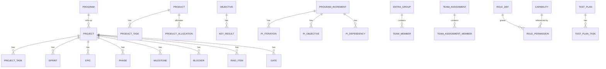
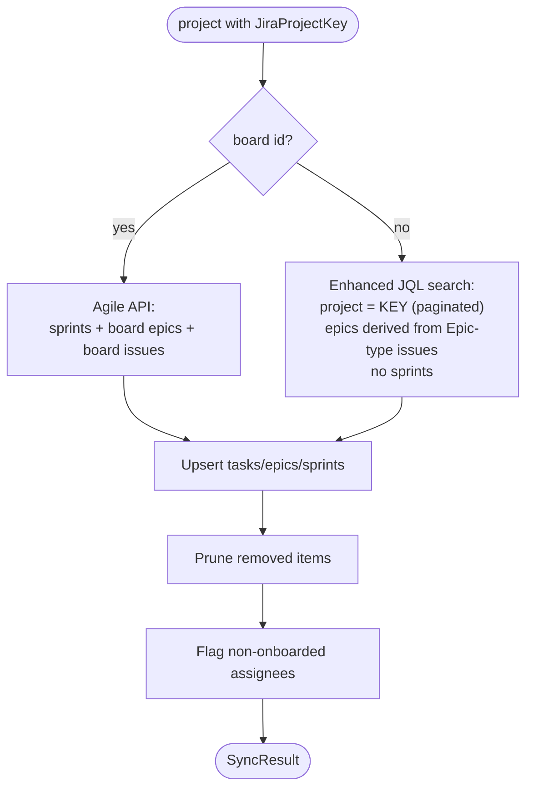
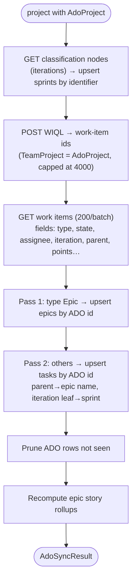

# Atlas PPM — Low Level Design (LLD)

> Companion to the [HLD](./hld.md). This document is the "how": data model,
> module/endpoint map, RBAC internals, request lifecycle, background workers,
> integration algorithms, configuration, testing — and the **decisions &
> trade-offs** behind them. Cross-references to [ADRs](./adr/) throughout.

## 1. Solution structure

```
atlas-frontend/
├─ src/                      # React SPA (inline-styled, token-driven — ADR-0003)
│  ├─ screens/               # one screen per file; heavy screens split into <screen>/data.ts (+ tests)
│  ├─ components/            # AppShell, Sidebar, Topbar, ui primitives, RoleContext, usePermissions
│  ├─ api.ts                 # typed fetch client (base /api/v1)
│  ├─ auth.ts                # MSAL / Entra glue
│  ├─ nav.ts · theme.ts      # screen catalogue + design tokens
│  └─ i18n/                  # 6-locale message catalogue
├─ server/                   # .NET 10 minimal API
│  ├─ Program.cs             # host build, middleware order, hosted services
│  ├─ Endpoints.cs           # MapAtlasEndpoints → all endpoint groups
│  ├─ <Feature>.cs           # one file per domain area (Tasks, Sprints, Jira, Pip, …)
│  ├─ Domain.<Domain>.cs · Dtos.cs   # entities split per domain (Delivery/Portfolio/
│  │                         #   Ops/People/Governance/Financials/Planning/Comms/Platform) + DTOs
│  ├─ AtlasDbContext.cs      # DbSets + model config
│  ├─ Permissions.cs · Rbac.cs   # authorization + capability matrix seed/reconcile
│  ├─ Migrations/            # EF Core migrations (applied on boot)
│  └─ Atlas.Tests/           # xUnit integration tests (WebApplicationFactory + InMemory)
└─ docs/                     # setup, docker, secrets, sso, observability, architecture/
```

The API is a **modular monolith** (ADR-0001): a single deployable process with
cohesive, independently-testable endpoint groups. This keeps operational and
cognitive overhead low at this scale while leaving a clean seam to extract a
service later (each group already talks only through `AtlasDbContext` + DTOs).

**Module boundaries are enforced** (ADR-0072): each domain lives in an
`Atlas.Api.<Domain>` namespace (Delivery/Portfolio/Operations/People/Governance/
Finance/Planning/Comms/Platform/Integrations) over a shared kernel, and an
IL-level dependency **ratchet** (NetArchTest + Mono.Cecil, in `Atlas.Tests`) fails
the build on new cross-domain cycles. The god-file `Domain.cs`/`WriteEndpoints.cs`
were split accordingly (`Domain.<Domain>.cs`, `WriteRequests.cs`). Runtime is
**.NET 10 / EF Core 10** (ADR-0073).

## 2. Request lifecycle & middleware order

`Program.cs` wires the pipeline (order matters):

1. **Forwarded headers** (behind nginx/LB) → correct scheme/host.
2. **Security headers** + HSTS (prod) — CSP, `X-Content-Type-Options`, frame/deny, etc.
3. **Rate limiter** — generous per-client fixed window (429 on abuse).
4. **Routing**.
5. **AuthN** (when `Auth:Enabled`) — JWT bearer validation (audience/issuer).
6. **Request logging** — assigns/propagates a **correlation id**; on an unhandled
   exception, returns a friendly problem payload carrying an error code
   (`SRV-…`, `INT-…`) that the client surfaces and the Help centre deep-links to.
7. **Endpoints** under `/api/v1` (auth required as a group when enabled).

Startup also: applies EF migrations, seeds RBAC + Help baseline, reconciles
capabilities/roles idempotently, and (optionally) seeds the demo portfolio when
`Seed:Enabled=true`.

## 3. Data model

~90 entities persisted via EF Core. Grouped logically (not an exhaustive ERD).
Per-user preferences are single-row-per-user tables keyed by `Permissions.CallerKey`
— `DashboardLayout` (custom dashboard) and `ThemePref` (selected UI theme, ADR-0076):



**Recent additions (this cycle)**
- `TimelineDependency` — a directed cross-entity link (`FromType/FromId →
  ToType/ToId`, `Source` = manual\|jira\|project) across project/program/product/
  release/sprint; drives the timeline dependency arrows (SBB-29). Index on
  `(FromType, FromId)`; migration `TimelineDependencies`.
- `Skill.Team` — owning manager slot ("" = shared/legacy) so the skills matrix is
  manager-scoped (SBB-20); migration `SkillTeam`.
- `TestPlanTask` gains `Description`, `StartDate`, `DueDate`, `EstimateHours`,
  `JiraKey`; `TestPlan.JiraBoardId` links a Jira agile board (SBB-30); migrations
  `TestPlanTaskFields`, `TestPlanJiraBoard`.
- The DPIA-gated personnel notes (Team SWOT + development plans, stored as JSON in
  `Settings`) are written/read through `PersonnelCrypto` (AES-256-GCM, `enc:v1:`
  marker) — encrypted at rest, key from the secret layer, never a schema column
  (SBB-31, ADR-0068).

**Persistence conventions**
- Human-facing ids (`PRJ-204`, `REL-…`, `OKR-…`) are `ValueGeneratedNever` strings
  minted by a helper; child rows use int identities.
- List-valued columns (e.g. demand geo-impact, cost owner-roles) are Postgres
  `text[]` with safe defaults so adding a column is backwards-compatible.
- New columns ship with defaults (`HasDefaultValue`) so migrations apply cleanly
  over existing rows.
- Derived values (OKR roll-ups, epic progress, capacity utilisation, assignee
  "known"/"on leave" flags, ROI) are computed **at read time**, not stored — the
  source of truth stays normalised (ADR-0012).

## 4. Module / endpoint map

All groups are mapped in `Endpoints.cs`. Representative surface (`/api/v1` prefix):

| Group | Endpoints (representative) | Notes |
|-------|----------------------------|-------|
| Projects | `GET /projects`, `/projects/{id}`, write via `MapAtlasWriteEndpoints` | buckets: active/completed/archived |
| Tasks | `GET/POST /projects/{id}/tasks`, `PATCH/DELETE /tasks/{id}`, comments | flags `assigneeOnLeave`, `assigneeKnown` |
| Sprints / Epics | `/projects/{id}/sprints`, `/sprints/{id}`, `/epics` | statuses; epic progress from linked tasks |
| Gantt | `/projects/{id}/gantt`, `/phases`, `/milestones`, `/programs/{id}/gantt`, `/portfolio/gantt` | month-grid model |
| PIP | `/increments`, `/pi-iterations`, `/pi-objectives`, `/pi-dependencies` | quarterly PI planning |
| Portfolio objects | `/programs`, `/products`, `/releases`, `/okrs`, `/demands` | CRUD + lifecycle |
| People & capacity | `/teams/*`, `/subteams/*`, `/resources` (opt. `from`/`to` window, ADR-0071), `/resources/by-project|by-product|unonboarded|onboard`, `/projects/{id}/capacity`, `/projects/{id}/assignments` (lead + architecture + **delivery roles** Technical Lead/Scrum Master, ADR-0070), `/labor-rates` (need-to-know; **admin sees none**, ADR-0057) | Entra + allocation-derived |
| Governance | `/gates`, `/raid`, `/dependencies`, `/architecture` (ADM/ARB), `/security`, `/quality`, `/decisions` | |
| Financials | `/financials`, `/costs`, ROI | overall + per entity |
| Comms | `/notifications`, `/news`, `/delivery`, comments | Graph email best-effort |
| Platform | `/roles`, `/audit(.csv)`, `/backups`, `/help`, `/gdpr`, retention, secret-rotation, `/dashboard/custom`, `/prefs/theme` (per-user, ADR-0076) | admin + per-user prefs |
| Integrations | `/projects/{id}/jira/sync`, discovery | pull-only |

## 5. Authorization (RBAC) internals

Server-authoritative (ADR-0004). The client mirror (`usePermissions`) only
hides affordances; it is never the control.

- **Capabilities** (`cap-projects`, `cap-schedule`, `cap-approve`, `cap-integrations`,
  `cap-quality`, `cap-users-roles`, `cap-okrs`, `cap-products`, …) — the units of
  access, seeded in `Rbac.cs`.
- **Levels**: `N` < `V` < `E` < `F` (None/View/Edit/Full), rank-compared.
- **Roles** (6 canonical): `admin`, `pmo`, `pm`, `team`, `exec`, `stkhldr`. Each has
  a level per capability (the seed strings). The 16 cosmetic header identities and
  the manager slots (teammgr/svcmgr/devmgr/devapac/blogit/inframgr/inframgr_apac/
  architect/pmlead) **resolve** onto these 6 (`UI_TO_ROLE` client-side;
  `Permissions.ManagerKey` keeps fine identity server-side for scope roll-ups). The
  regional managers (devapac/blogit/inframgr_apac) clone their base manager's
  mapping and differ only in labour-rate visibility (ADR-0057).
- **Check**: `Permissions.Allows(http, db, cfg, cap, level)` → bool;
  `Permissions.Deny(...)` → a `403` result or null. Role comes from the validated
  JWT (prod) or the `X-Atlas-Role` header (dev/tests).
- **Reconcile**: `Rbac.ReconcileAsync` runs every boot, adding capabilities/roles
  introduced after the initial seed with sensible defaults — never overwriting an
  admin's matrix edits (idempotent upgrade path).

## 6. Cross-cutting services

| Concern | Realisation |
|---------|-------------|
| AuthZ | `Permissions` (see §5) |
| Errors & correlation | `Logging` middleware — correlation id + coded friendly errors |
| Rate limiting | `AddAtlasRateLimiter` (fixed-window per client) |
| Telemetry | `Telemetry`/`Observability` — OTel traces/metrics/logs over OTLP |
| Health | `/health` (liveness), `/health/ready` (DB reachable) |
| Audit | append-only `AuditEvent` written by write endpoints; read on Admin → Audit |
| Config | `IConfiguration` (env / Docker secrets) — 12-factor |

## 7. Background workers & integration algorithms

Registered in `Program.cs` as `IHostedService`s; each opens its own DI scope per pass.

### 7.1 `JiraSyncService` (scheduled, ADR-0007)
- Enabled by default (`Jira:ScheduledSync`), idle until a Jira connector is configured.
- Every `Jira:SyncMinutes` (default 30, min 5): loads non-archived projects with a
  Jira key, and calls `Jira.SyncProjectAsync` per project (best-effort — one failure
  is logged and does not stop the pass).

### 7.2 `Jira.SyncProjectAsync` (board-optional, ADR-0006)

- **Auto-pull on link**: setting/changing a project's Jira key (create or edit)
  triggers one best-effort sync inline, so tasks appear without a manual step; the
  manual **Sync** button remains the on-demand force and surfaces connector errors.

### 7.2a `AzureDevOps.SyncProjectAsync` (pull-only, ADR-0035/0036)

- **Keys on `Project.AdoProject`** (org is global config). Idempotent by `AdoId`
  on `Sprint`/`Epic`/`ProjectTask`; locally-created rows (`AdoId == ""`) untouched;
  full pull prunes rows whose ADO id vanished (same contract as Jira).
- **State mapping** (`MapAdoState`) covers Agile/Scrum/Basic processes; priority
  1–4 → Critical/High/Medium/Low; `IterationPath` leaf → sprint; `System.Parent`
  → epic name; `System.Description` HTML → text. Two entry points: per-project
  (`/projects/{id}/ado/sync`) and all-mapped (`/integrations/ado/sync`).
- **Background** (ADR-0039): `?background=true` on either sync endpoint enqueues
  an `AdoSyncQueue` job (202 + jobId) drained by `AdoSyncWorker`; poll
  `/integrations/ado/sync/status/{jobId}`. The synchronous path stays the
  default. Off the request path, the cap is `AzureDevOps:MaxWorkItems`
  (default 20000, WIQL's ceiling), fetched 200/request; `Truncated` flags an
  exceed.

### 7.3 `RetentionHostedService`
- Daily; anonymises/removes records past their retention window (GDPR). Off by
  config where not wanted; nothing is touched until records actually age out.

### 7.4 Resources derivation
`/resources` is computed from **real allocation sources** (not a standalone sheet):
product allocations (`ProductAllocation.Alloc`) + project team-assignment members
(`TeamAssignmentMember.Alloc`) + active ops items (`Ops.AllocByPersonAsync`) + the
Entra roster, keyed by name. Utilisation = Ops% + Project% + Product%; >100% flags
over-allocation. `/resources/unonboarded` lists task assignees absent from the
directory; `/resources/onboard` adds them to a manual directory group so they
become "known" on the next read/sync. With `from`/`to` (ADR-0071) the roster is
the **average of each person's per-working-day load over the window**
(`RosterWindowAsync`), computed from the same per-day helpers as the snapshot and
the Excel export (`AllocationEngine.ProjectPlannedFor`/`TaskLoadFor`/
`CombineProjectLoad`) so the three can't drift; no window ⇒ single-day snapshot.

### 7.5 Time-phased allocation & availability (ADR-0013)
`TeamAssignmentMember` is a **dated segment**: base (`Alloc`/`AllocHours`,
`StartDate`, `EndDate`) plus an optional extension (`Ext*`). `AllocMath` is the one
capacity basis — `PctFromHours` (40 h/week = 100%) and `ActiveOn(start,end,day)`
(empty bounds = open). `/resources?asOf=` and `/resources/availability` count only
segments **live on the day**; availability slices each person's load by
project/program/release/product/ops, nets **booked absences** to unavailable, and
in window mode reports `free = 100 − peak load` across the window (peak evaluated
at segment boundaries). Individuals attach directly via `SubTeamId 0`.

### 7.6 Ops roll-up & project impact (ADR-0014)
`OpsItem.Alloc` on active items sums per assignee into Ops% (above). Items tagged
with `ImpactProjectId` surface on that project (`/projects/{id}/ops-impact`) and
count toward its "operational load".

### 7.7 Excel exports (ADR-0015)
`AllocationReport` buckets `[from,to]` by period, accumulates per-person
**person-days** over weekdays from the live allocations, and renders a ClosedXML
workbook (util% heat + person-day comments). `Skills` exports the matrix as a
proficiency ramp. Both stream `.xlsx` via the standard file result.

### 7.8 Team capacity (project)
`/projects/{id}/capacity` unions People & roles with the members of any team
attached to the project (sub-teams **and** individuals) and reports each person's
live utilisation from §7.4–7.5 — not the legacy `Resources` sheet.

## 8. Frontend design (salient points)
- **State**: server state via TanStack Query (`useQuery`/`useMutation`) with
  loading/empty/error states; empty is the default (no fabricated data, ADR-0012).
  Live views (dashboard, resources) refetch on mount/focus/interval.
- **Styling**: inline styles from `theme.ts` tokens only — no CSS framework
  (ADR-0003). Shared primitives in `components/ui.tsx`.
- **Theming**: every colour/chart/font token is a `var(--atlas-*, <fallback>)`
  reference; `applyThemeVars(id)` writes the active palette onto `:root` (resolved
  through the `style` prop, so no global stylesheet). Five themes — **Atlas Light**
  (default) + **Atlas Command/Daylight/Carbon** brand themes (ADR-0074) + gated
  Atlas Dark — chosen via a top-bar picker; `primary` (accent text) and
  `primaryFill` (white-text button bg) are split so all clear WCAG AA on every
  ground (ADR-0075, axe-gated). Charts re-skin via `--atlas-chart-*` (ADR-0076).
  Fonts are **theme-aware** (Public Sans/Space Mono on Light/Dark; IBM Plex on the
  brand themes, ADR-0077) and **self-hosted/bundled** — no font CDN (ADR-0078).
  The chosen theme is saved **per user server-side** (`/prefs/theme`) so it follows
  a signed-in user across devices; signed out it falls back to `localStorage`
  (ADR-0056, ADR-0076).
- **Testable logic** lives in `screens/<screen>/data.ts` (pure funcs, unit-tested);
  components stay thin (e.g. `pip/data.ts`, `portfolio/data.ts`).
- **Large screens are decomposed** into a folder of per-tab modules with a
  `shared.tsx` (presentational helpers) + `util.ts` (non-component helpers) —
  see `screens/project/` and `screens/resources/` (ADR-0041).
- **Auth**: MSAL redirect flow in `auth.ts`; disabled cleanly when `VITE_AUTH_ENABLED=false`.

## 9. Configuration keys (selected)

| Key | Purpose |
|-----|---------|
| `ConnectionStrings__Postgres` | DB connection; password-based, or **passwordless** with `SSL Mode=VerifyFull;Root Certificate=…;SSL Certificate=…;SSL Key=…` (client-cert auth, ADR-0069) |
| `Bao:Address`, `Bao:Token`, `Bao:Mount`, `Bao:Path` | OpenBao/Vault KV v2 secrets provider (inert unless address+token set, ADR-0067) |
| `Personnel:EncryptionKey`, `Personnel:EncryptionKeyOld` | AES-256-GCM key(s) for personnel-notes field encryption; primary + optional old key for rotation (inert unless set, ADR-0068) |
| `Auth:Enabled`, `Auth:TenantId`, `Auth:Audience` | Entra JWT validation |
| `VITE_AUTH_ENABLED`, `VITE_AUTH_*` | SPA MSAL config |
| `Jira:BaseUrl`, `Jira:Email`, `Jira:ApiToken` | Jira connector |
| `Jira:ScheduledSync`, `Jira:SyncMinutes` | scheduled sync toggle/interval |
| `AzureDevOps:Organization`, `AzureDevOps:Pat` | Azure DevOps connector (discovery, import, work-item sync) |
| `AzureDevOps:MaxWorkItems` | ADO work-item pull ceiling (default 20000) |
| `Graph:*`, `Notifications:SenderUpn` | notification email via Graph |
| `Seed:Enabled` | load demo portfolio (non-prod only) |
| `Retention:Enabled` | retention/anonymisation worker |
| `OTEL_EXPORTER_OTLP_ENDPOINT` | observability export |

## 10. Testing strategy
- **Backend**: xUnit integration tests via `WebApplicationFactory<Program>` on an
  InMemory provider; role via `X-Atlas-Role`; `Seed:Enabled=false` so tests create
  their own data. Parallelisation disabled (shared InMemory store). ~270 tests.
- **Frontend**: Vitest + Testing Library — pure `data.ts` logic + component smoke
  tests (mocked `api`), plus an i18n completeness test.
- **CI**: GitHub Actions runs API build+test and frontend lint+test+build on PRs
  to `main`, with a production-dependency security audit gate.

## 11. Decisions & trade-offs (index)

The material decisions are recorded as [ADRs](./adr/). Summary of the key
trade-offs:

| Decision | Chosen | Trade-off accepted | ADR |
|----------|--------|--------------------|-----|
| API shape | Modular monolith, minimal API | Less isolation than microservices; mitigated by clean module seams | [0001](./adr/0001-modular-monolith-minimal-api.md) |
| Data store | PostgreSQL + EF Core | ORM abstraction cost; gained migrations, `text[]`, portability | [0002](./adr/0002-postgresql-ef-core.md) |
| Frontend styling | Inline tokens, no framework | Verbose styles; gained prototype fidelity + zero CSS build risk | [0003](./adr/0003-inline-styled-frontend.md) |
| AuthZ | Server-authoritative capability matrix | Client duplicates checks cosmetically; security stays on the server | [0004](./adr/0004-rbac-capability-matrix.md) |
| Identity | Entra SSO, fail-fast on misconfig | Local dev needs auth disabled explicitly | [0005](./adr/0005-entra-sso.md) |
| Jira | Pull-only, board-optional | No write-back; simpler, safe, maps "spaces" | [0006](./adr/0006-jira-pull-only-board-optional.md) |
| Azure DevOps | Pull-only; PAT auth; WIQL + iterations | No write-back; work-item sync bounded (4000), no attachments yet | [0035](./adr/0035-azure-devops-connector.md), [0036](./adr/0036-azure-devops-work-item-sync.md) |
| Async work | In-process hosted services | No distributed scheduler; fine at this scale | [0007](./adr/0007-in-process-background-workers.md) |
| Edge | Same-origin nginx + headers/CSP | Extra container; removes CORS + centralises headers | [0008](./adr/0008-same-origin-edge.md) |
| Secrets | Docker secrets / env, never committed | Ops must inject; no secrets in VCS | [0009](./adr/0009-secrets-management.md) |
| Observability | OpenTelemetry / OTLP | Vendor-neutral; needs a collector to see data | [0010](./adr/0010-observability-otel.md) |
| Docs format | Markdown + Mermaid, ADRs | Not a modelling tool; renders everywhere, versioned with code | [0011](./adr/0011-docs-as-code.md) |
| Data seeding | Empty-by-default, derive-on-read | Blank first-run; honest data, no drift | [0012](./adr/0012-empty-states-derive-on-read.md) |
