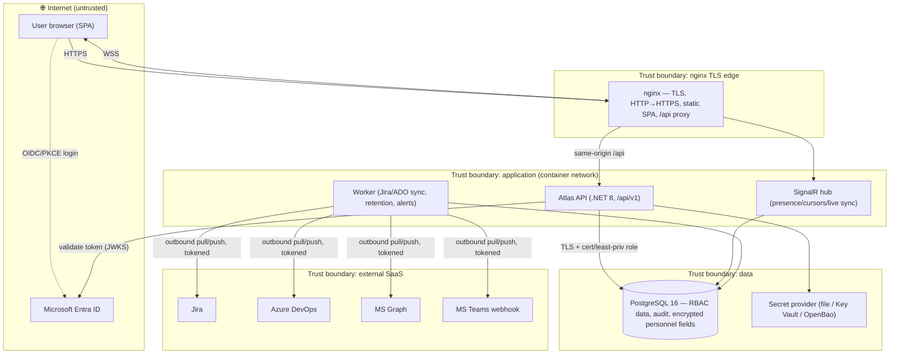

# Atlas PPM — Threat Model

**Status:** Living document · **Last reviewed:** 2026-07-16
**Owners:** Security + Architecture · **Cadence:** re-review each release and on any
new trust boundary, external interface, or data class (see §10).

This is an evidence-based threat model of the Atlas PPM platform. It combines
several best-of-breed techniques rather than relying on one:

- **STRIDE** (Microsoft) — per-interaction analysis of Spoofing, Tampering,
  Repudiation, Information disclosure, Denial of service, Elevation of privilege
  (§4). STRIDE is the spine.
- **LINDDUN** — a privacy-specific complement (Linkability, Identifiability,
  Non-repudiation, Detectability, Disclosure, Unawareness, Non-compliance),
  because Atlas processes personal and personnel data under GDPR (§5).
- **OWASP Risk Rating** (likelihood × impact) — to prioritise the risk register
  rather than the deprecated DREAD scoring (§6).
- **MITRE ATT&CK** mapping — to connect threats to real adversary techniques and
  to the platform's existing ATT&CK references in the compliance engine (§7).
- **Attack-tree thinking** — used inline for the highest-value goals
  (steal personnel data; forge an approval) rather than as exhaustive trees (§8).

It is grounded in the architecture (HLD/LLD, building-blocks) and cites the
**controls already implemented** with their ADRs, so mitigations are verifiable,
not aspirational. Residual gaps are stated, not smoothed over.

---

## 1. Scope & assumptions

**In scope:** the Atlas web app (React SPA), the .NET 8 API (`/api/v1`), the
SignalR collaboration hub, the background **worker**, PostgreSQL, the nginx TLS
edge, and the outbound integrations (Jira, Azure DevOps, Microsoft Graph,
Microsoft Teams). On-prem single-node Docker Compose is the deployment target
(ADR-0054).

**Out of scope (trust-assumed / owned elsewhere):** Microsoft Entra ID and the
tenant's Conditional Access/MFA policy; the corporate PKI / CA; the host OS and
container runtime hardening; the external SaaS (Jira/ADO/Graph/Teams) internals;
physical security of the host.

**Key assumptions:**
- Entra is the identity authority; tokens are validated server-side when
  `Auth:Enabled` (ADR-0004). The header role-switcher is **cosmetic** — the API is
  the authorization boundary (CLAUDE.md §7).
- TLS terminates at nginx; the app is served same-origin (no CORS surface).
- Secrets are supplied by the layered provider chain (file secrets → Azure Key
  Vault → OpenBao KV v2, ADR-0009/0067), never committed.
- Only authenticated internal users reach `/api/v1`; there is **no anonymous/
  public endpoint** (FR-DEM-4).

---

## 2. Assets & security objectives

| # | Asset | Why it matters | Primary objective |
|---|-------|----------------|-------------------|
| A1 | **Personnel data** — Team SWOT, individual development plans | Sensitive HR/GDPR special-category-adjacent data | Confidentiality, lawful processing |
| A2 | **Financial data** — labour rates, budgets, costs, ROI | Commercially sensitive; segregation of duties | Confidentiality, integrity |
| A3 | **Portfolio data** — projects, demands, RAID, gates, decisions | Business record; drives governance | Integrity, availability |
| A4 | **Approvals & audit log** | Governance evidence; must be trustworthy | Integrity, non-repudiation |
| A5 | **Integration credentials** — Jira/ADO/Graph/Teams tokens, DB creds | Pivot to external systems / data | Confidentiality |
| A6 | **Identity & session** — Entra tokens, session state | Account takeover surface | Authentication, confidentiality |
| A7 | **Availability of the service** | PMO/exec decision-making depends on it | Availability |

---

## 3. System decomposition & trust boundaries (DFD)

**Trust boundaries (where data changes trust level):**
- **TB1 Internet → nginx** — TLS termination, the only exposed surface.
- **TB2 Browser → API** — authentication + authorization boundary (the important one).
- **TB3 API/worker → PostgreSQL** — data-at-rest boundary; TLS + least-privilege + field encryption.
- **TB4 API/worker → external SaaS** — egress boundary; credential handling.
- **TB5 Operator/host → secrets & DB volume** — deployment boundary.

---

## 4. STRIDE analysis (per interaction / element)

Ratings use OWASP-style **Likelihood × Impact** → risk (see §6). "Controls" cite
what is **already implemented**; "Residual" is what remains.

### TB2 — Browser ⇄ API (the authorization boundary)

| STRIDE | Threat | Controls in place | Residual / risk |
|--------|--------|-------------------|-----------------|
| **S**poofing | Forged/replayed identity; using the cosmetic role-switcher to act as another role | Entra OIDC + server-side JWT validation (JWKS, audience/issuer), PKCE; **header role is cosmetic, server enforces the canonical role** (CLAUDE.md §7); 15-min idle logout (ADR-0038) | Low — depends on tenant MFA/Conditional Access (assumed) |
| **T**ampering | Mutating another entity via crafted request (IDOR); privileged writes | Server-authoritative **capability matrix** per endpoint (`Permissions.cs`/`Rbac.cs`); ownership/scope checks (e.g. skills manager-scope, rate need-to-know); input sanitisation + bounds on collaborative surfaces | Low — authz integration tests + no-IDOR review; sustained by pen-test |
| **R**epudiation | Denying an approval / gate decision / assignment | Append-only **`AuditEvent`** on write endpoints (actor, action, target); gates/ARB sign-off recorded | Low — audit not yet shipped to external SIEM (operator step) |
| **I**nfo disclosure | Reading data above one's need-to-know (rates, personnel, other teams) | **Need-to-know + segregation-of-duties filters**: region-scoped labour rates with **Platform Admin excluded entirely** (ADR-0057), manager-scoped skills (ADR-0016), manager-only dev-plans (ADR-0062); server filters the wire response | Low |
| **D**oS | Request flooding; oversized uploads; expensive sync on the request path | Rate limiter; upload size/allowlist; **web/worker split** moves heavy sync off the request path (ADR-0048); background queues (ADR-0039) | Medium — single-node has no autoscale; edge rate-limit tuning is operator-owned |
| **E**oP | Privilege escalation to admin/PMO capabilities | Coarse+fine role checks server-side; created roles can't grant capabilities they don't hold; task-board move scoped to planner roles (ADR-0065) | Low |

### TB1 — Internet → nginx edge

| STRIDE | Threat | Controls | Residual |
|--------|--------|----------|----------|
| T / I | TLS downgrade, header injection, clickjacking, XSS | TLS + HTTP→HTTPS redirect; **CSP + security headers**, HSTS; SPA is inline-styled with a strict CSP; React escaping | Low — CSP tuned for the app; keep it strict as features land |
| D | Volumetric DoS at the edge | nginx limits; upstream WAF/CDN is an operator option | Medium — no CDN/WAF in the single-node target |

### TB3 — API/worker → PostgreSQL

| STRIDE | Threat | Controls | Residual |
|--------|--------|----------|----------|
| S | App impersonating a higher-privileged DB principal | **Least-privilege DB role** (`postgres-least-privilege.sql`); optional **passwordless TLS client-cert auth** (ADR-0069) | Low |
| T / I | Sniffing/altering data in transit; reading the volume/backups at rest | TLS to the DB; **AES-256-GCM field encryption for personnel notes** with the key held outside the DB (ADR-0068); backups | Medium — full host/volume at-rest encryption is an operator step (GDPR Art. 32) |
| I | SQL injection | EF Core parameterised queries throughout (no string-built SQL) | Low |
| R | Direct DB writes bypassing the audit trail | Least-privilege role; app is the only writer; DB-level audit option documented (security-hardening.md) | Medium — a DB admin with direct access is outside the app's control |

### TB4 — API/worker → external SaaS (egress)

| STRIDE | Threat | Controls | Residual |
|--------|--------|----------|----------|
| S / I | Credential theft → pivot to Jira/ADO/Graph/Teams; secrets in logs/`docker inspect` | **Layered secret provider** (file → Key Vault → OpenBao, ADR-0009/0067); masked-secret status in the UI; least-privilege service accounts (pull-only where possible); no secret in env when file-mounted | Medium — token rotation is operator-owned (OpenBao dynamic creds is the path) |
| T | Poisoned inbound sync data (malicious Jira/ADO content) rendering as XSS or corrupting records | Server-side sanitisation + bounds on ingested fields; React escaping; idempotent, keyed upserts | Low–Medium — treat all external content as untrusted (ingest sanitisation sustained by tests) |
| D | A slow/hostile SaaS stalling Atlas | Sync runs in the **worker** off the request path; paging + best-effort try/catch per call | Low |

### SignalR collaboration hub

| STRIDE | Threat | Controls | Residual |
|--------|--------|----------|----------|
| T / E | A client broadcasting unauthorized changes to a room | Hub carries **no client domain writes**; ops are server-authorized and scope-gated by the same capability as the entity; per-row typed writes (ADR-0061/0064) | Low |
| I | Presence leaking personal data | Data-minimised presence (name/initials/colour only, nothing persisted) | Low |

---

## 5. LINDDUN privacy analysis (personal & personnel data)

Focused on A1 (personnel notes) and A6 (identity), the GDPR-relevant assets.

| LINDDUN | Threat | Controls in place | Residual |
|---------|--------|-------------------|----------|
| **L**inkability | Correlating a person across projects/allocations to profile them | Allocation/roster keyed by display name for function, not profiling; dev-plans manager-scoped and never shown to the subject (ADR-0062) | Accepted — necessary for capacity planning; minimised |
| **I**dentifiability | Re-identifying individuals in exports/logs | Data-minimised presence; audit records the actor, not bulk PII; exports are manager-scoped | Low |
| **N**on-repudiation (privacy sense) | Subject unable to deny an action / over-retention of attributable logs | Retention job prunes on policy (Art. 17) while preserving append-only integrity | Low |
| **D**etectability | Inferring that a sensitive record exists (e.g. a dev-plan) | Dev-plans are **manager-visible only**, never surfaced to the subject; personnel features **gated off by default** until DPIA + MBL §11 (ADR-0063) | Low |
| **D**isclosure of information | Unauthorized read of SWOT/dev-plan notes | **AES-256-GCM field encryption at rest** (ADR-0068); manager-scoped access; server-side filtering | Low–Medium — full at-rest volume encryption + DPIA sign-off outstanding |
| **U**nawareness | Subjects unaware of processing | DPIA/ROPA + `docs/dpia-personnel-data.md`; processing gate keeps features off until sign-off | Medium — DPIA/ROPA formal sign-off is an organizational action |
| **N**on-compliance | Processing without a lawful basis / Swedish co-determination | Personnel processing **gated behind a flag** enforced server-side until DPIA + **MBL §11** union consultation (ADR-0063, `docs/compliance-sweden.md`); DSAR export + erasure | Medium — sign-off pending; the gate makes non-compliant processing fail-closed |

---

## 6. Risk register (prioritised)

Likelihood/Impact: L/M/H. Risk = the OWASP-style combination. Ordered by risk.

| ID | Risk | L | I | Risk | Existing mitigation | Recommended next step | Owner |
|----|------|---|---|------|---------------------|-----------------------|-------|
| R1 | Personnel notes readable from a stolen DB volume/backup before full at-rest encryption | M | H | **High** | Field-level AES-GCM (ADR-0068); DPIA gate default-off | Turn on host/volume encryption in prod; complete DPIA/ROPA + MBL §11 | Ops + DPO |
| R2 | Integration/DB credential compromise → external pivot | L | H | **Medium** | Layered secret provider (ADR-0067); passwordless DB (ADR-0069); least-priv accounts | Automate rotation (OpenBao dynamic creds / cert rotation); scope tokens tighter | Ops |
| R3 | Undiscovered authz/IDOR or business-logic flaw | L | H | **Medium** | Server-authoritative RBAC + authz tests; SAST/SCA gates | **Commission the independent human pen-test** (`docs/pentest-scope.md`) | Security |
| R4 | Edge/application DoS (single-node, no CDN/WAF) | M | M | **Medium** | Rate limiter; web/worker split; health-gated restart | Front with WAF/CDN or move to Azure for autoscale/HA | Ops |
| R5 | Poisoned inbound SaaS content (XSS / record corruption) | L | M | **Low–Med** | Ingest sanitisation + bounds; React escaping; idempotent upserts | Keep sanitisation under test as new ingests land | Eng |
| R6 | Loss of availability / no PITR on single node | L | M | **Low–Med** | Backup snapshot; healthchecks; compose recreate | Azure managed Postgres (PITR/replication) when scale/HA is needed | Ops |
| R7 | Audit trail not centralised (tamper/scale visibility) | L | M | **Low** | Append-only `AuditEvent`; correlation IDs; OTel | Ship audit + traces to a SIEM | Ops |

No **Critical** open risks: the highest-impact data (personnel) is field-encrypted
and gated, and the highest-likelihood classes (authz, injection, secret exposure)
have implemented, tested controls. The residual set is dominated by
**operator/organizational** actions (at-rest encryption, DPIA sign-off, pen-test,
HA), consistent with the application evaluation.

---

## 7. MITRE ATT&CK mapping (enterprise)

Ties the threats above to adversary techniques (the compliance engine already
references ATT&CK, ADR-0049):

| Tactic | Technique (ID) | Relevant threat | Primary defence |
|--------|----------------|-----------------|-----------------|
| Initial Access | Valid Accounts (T1078) | R3, S@TB2 | Entra + MFA (tenant), server token validation, idle logout |
| Credential Access | Unsecured Credentials (T1552) | R2 | Layered secret provider; passwordless DB; no secret in env/logs |
| Collection | Data from Information Repositories (T1213) | R1, I@TB2 | Need-to-know filters; field encryption; audit |
| Exfiltration | Exfil over Web Service (T1567) | R2, TB4 | Egress via worker only; least-priv tokens; masked in UI |
| Privilege Escalation | Exploitation for Priv-Esc (T1068) / abuse of role | E@TB2 | Server-authoritative capability matrix; scoped moves (ADR-0065) |
| Impact | Endpoint/Network DoS (T1499/T1498) | R4 | Rate limiter; worker split; WAF/CDN recommendation |
| Defense Evasion | Impair Defenses / log tamper | R7 | Append-only audit; least-priv DB role |

---

## 8. Focused attack-tree sketches (highest-value goals)

**Goal G1 — Read another team's personnel notes**
- via the API → blocked by manager-scope + server filter (ADR-0062/0016).
- via the DB volume/backup → blocked by field encryption (ADR-0068) **unless** the
  attacker also has the key (held outside the DB) → **R1** (add host at-rest enc).
- via the role-switcher → no effect (cosmetic; server enforces).

**Goal G2 — Forge or alter an approval/gate decision**
- via the API → requires the gated capability, and the write is **audited** (R@TB2);
  altering the audit requires direct DB write → least-priv role blocks the app path
  → residual is a privileged DBA (out of app scope) → **R7** (SIEM/off-box audit).

These confirm the register: the residual paths are at-rest encryption (R1) and
off-box audit (R7), both operator actions.

---

## 9. Control traceability (threat → evidence)

| Control | Where | ADR |
|---------|-------|-----|
| Server-authoritative RBAC + capability matrix | `Permissions.cs`, `Rbac.cs` | ADR-0004 |
| Need-to-know rates; Platform Admin excluded | `LaborRates.cs` | ADR-0055/0057 |
| Manager-scoped skills / dev-plans | `Skills.cs`, `Teams.cs` | ADR-0016/0062 |
| Personnel field encryption (AES-GCM) | `PersonnelCrypto.cs` | ADR-0068 |
| Personnel processing gate (DPIA/MBL) | `Teams.cs` flag | ADR-0063 |
| Layered secret provider (file/KV/OpenBao) | `Secrets.cs`, `OpenBao.cs` | ADR-0009/0067 |
| Passwordless Postgres (cert auth) | compose overlay | ADR-0069 |
| Append-only audit | `Permissions.Audit` on writes | — |
| CSP/headers, rate limit, upload allowlist, non-root, least-priv DB | `Hardening.cs`, nginx, compose | ADR-0008 |
| AppSec CI gates (SAST/SCA/secrets/IaC/DAST) | `security-scan.yml` | ADR-0051/0053 |
| Web/worker split (DoS isolation) | `Atlas__Role` | ADR-0048 |

---

## 10. Review cadence & change triggers

Re-run this model when any of the following change, and at minimum **once per
release**:
- a new **trust boundary** or externally reachable interface (new connector, new
  hub, a public endpoint);
- a new **data class** (especially personal/financial/special-category);
- a change to **authentication or authorization** logic;
- a new **third-party dependency** with network or data access.

Findings feed the risk register (§6) and, where they change a decision, an ADR.
This document is the qualitative companion to the automated AppSec gates
(SAST/SCA/DAST) and the planned human penetration test (`docs/pentest-scope.md`).
